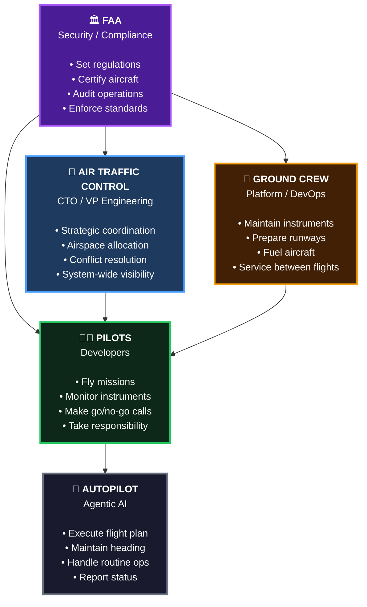

# No Instruments, No Delivery: The Enterprise Agentic Imperative

*An executive briefing for decision-makers authorizing AI investment*

---

## The Shift: From Coders to Captains

Your competitors are investing in agentic AI to accelerate software delivery. The enterprises that establish the right infrastructure in 2025–2026 will compound an operational advantage that latecomers cannot easily replicate—not because the tools are proprietary, but because the institutional muscle memory takes 18–24 months to build.

The question isn't whether AI changes software development. It already has—developers complete tasks 55% faster with AI assistance (GitHub/Microsoft Research, 2022), and enterprise-validated productivity uplifts of 20–45% are documented across organizations (McKinsey Digital, 2023). The question is whether your organization can capture that change safely—or whether "moving faster" simply means "failing faster at enterprise scale."

**The shift isn't from "developer" to "obsolete." It's from "Coder" to "Captain."**

Consider what a commercial airline pilot actually does. They don't hand-fly the aircraft for most of the journey. Modern aircraft have sophisticated autopilot systems that handle altitude, heading, speed, and even landing in low-visibility conditions. The autopilot does the mechanical work of flying.

But no one suggests we don't need pilots.

The question for enterprise leaders isn't "Will AI replace our developers?" It's "Are our developers equipped to fly?"

And critically: **Do they have the system around them to fly safely?**

---

## The System: How Flight Operations Work

Before we zoom into the cockpit, let's understand the entire system that makes flight possible. Aviation isn't just pilots and planes—it's a coordinated ecosystem where every role is essential.

*Caption: The Complete Flight Operations System — Every role is essential. Pilots command the autopilot, but they can't fly without ground crew maintaining their instruments, ATC coordinating the airspace, and the FAA setting the rules.*

### 🤖 Autopilot → Agentic AI

The autopilot doesn't replace the pilot—it handles the mechanical work of flying so the pilot can focus on judgment, decision-making, and responsibility.

In software delivery, **agentic AI is your autopilot**. It executes the flight plan, handles routine operations like testing and refactoring, and reports status—all without the pilot touching the controls during cruise. Powerful, and only safe with a pilot who knows when to intervene.

Autopilot without a pilot is just an expensive way to crash.

### 👨‍✈️ Pilots → Developers

Developers become **flight captains**: they plan the mission, make go/no-go calls, monitor instruments during cruise, intervene when something goes wrong, and take responsibility for every deployment. They are not faster typists. They are accountable decision-makers with AI doing the mechanical work.

This is exactly what developers become in an agentic world.

### 🗼 Air Traffic Control → CTO / VP Engineering

In an agentic world, the CTO/VP Engineering role intensifies. With developers flying multiple concurrent AI sessions, coordination complexity compounds. ATC coordinates missions, allocates resources, resolves conflicts between teams, and maintains fleet-wide visibility. The value of technical leadership grows precisely when the pace of delivery grows.

### 🔧 Ground Crew → Platform / DevOps

Platform and DevOps teams are the force multiplier behind the multiplier. They build and operate the instrument panel—dashboards, pipelines, automated gates—that make agentic sessions safe to supervise. In the agentic model, platform investment is not overhead; it is the infrastructure that determines whether your AI spend returns value or creates risk.

The ground crew's work is invisible when it's done well. But without them, pilots have no instruments, no runways, and no fuel.

### 🏛️ FAA → Security / Compliance

Security and compliance teams set the rules that make agentic speed sustainable. They define what "green" looks like on the compliance instrument, approve the patterns AI is permitted to use, and enforce the gates that block unsafe code before it reaches production. In an agentic delivery model, automated enforcement by your security function is what separates "move fast" from "move recklessly."

---

*Now let's zoom into the cockpit and see what pilots actually work with.*

---

## The Cockpit: Your Six Pack

Every pilot learns the "six-pack"—the six primary flight instruments that provide essential situational awareness. These instruments tell the pilot: Am I climbing or descending? Am I turning? Am I going the right speed? Am I at the right altitude? Will I arrive where I intend to go? And am I safe to continue?

Without these instruments, a pilot in clouds is flying blind. Spatial disorientation sets in within seconds. Accidents follow within minutes.

Developers flying agentic missions need their own "Six Pack". These are the instruments that answer: Is this code safe to ship? Is it legal to deploy? Will it perform? Can we roll it back?

*Caption: Developer Instrument Panel — The six readings that determine flight readiness. All green means cleared for deployment. Any red grounds the flight.*

Each instrument provides a single traffic-light reading (green/yellow/red) aggregated into a unified dashboard. Here is what each measures and why it matters at the leadership level:

### 🧪 Test Health

Automated test results verify that AI-generated code does what was intended. A green panel means the developer can proceed with confidence. Red grounds the flight—no deployment until resolved. Without this instrument, there is no reliable signal that agentic output is correct.

### 🔒 Security Posture

Automated vulnerability scanning runs against every line AI produces and gates deployment on a clean result. The average enterprise data breach cost $4.88M in 2024 (IBM Cost of a Data Breach Report)—before regulatory fines and legal exposure. Automated security gates are the cheapest line in your risk budget.

### ⚡ Performance Baseline

Automated comparison against production benchmarks catches regressions before they ship. AI can produce functionally correct code that silently degrades user experience under load—this instrument catches that before it reaches customers. Silent degradation drives churn before you know you have a problem.

### 📋 Compliance Gates

Automated policy checks verify every change against your active compliance frameworks—SOC2, HIPAA, FedRAMP, GDPR, and others. Since 2023, the SEC requires material cybersecurity incident disclosure within 4 business days. Compliance automation is not a development practice; it is a board governance control that runs on every commit.

### 🚀 Deployment Window

Change management policies are surfaced as a real-time gate. Agentic sessions can produce deployable code at any hour; deployment windows enforce your organizational risk policy automatically. The instrument prevents AI from shipping code during periods your change management process has designated as high-risk—without requiring human intervention to enforce it.

### 📦 Dependency Health

Automated supply chain scanning validates every package AI introduces against known vulnerabilities. The SolarWinds and Log4j incidents demonstrated what supply chain compromise costs enterprises: tens of millions in direct recovery, plus regulatory and reputational fallout. This gate prevents AI from importing risk your organization has not explicitly approved.

---

## The Flight: Phases of Agentic Delivery

A flight has distinct phases, each with different levels of automation and human involvement. Agentic software delivery follows the same pattern.

```mermaid
flowchart TB
    subgraph row1[" "]
        direction LR
        subgraph preflight["✈️ PRE-FLIGHT — Human Authority Required"]
            direction TB
            p1["📋 Check instruments"]
            p2["🗺️ File flight plan"]
            p3["⛽ Verify resources"]
            p4["✅ Go/No-go decision"]
        end

        subgraph takeoff["🛫 TAKEOFF — Human Authority Required"]
            direction TB
            t1["🎯 Define task scope"]
            t2["🤖 Initialize agent"]
            t3["📍 Set guardrails"]
            t4["▶️ Begin execution"]
        end
    end

    subgraph row2[" "]
        direction LR
        subgraph cruise["✈️ CRUISE — AI Autonomy + Human Monitoring"]
            direction TB
            c1["👁️ Monitor instruments"]
            c2["🔄 Steer as needed"]
            c3["⚠️ Handle turbulence"]
            c4["🤖 AI executes"]
        end

        subgraph landing["🛬 LANDING — Human Authority Required"]
            direction TB
            l1["✅ Verify completion"]
            l2["📊 Check all instruments"]
            l3["🔐 Attest quality"]
            l4["🚀 Deploy"]
        end
    end

    preflight --> takeoff
    takeoff --> cruise
    cruise --> landing

    style preflight fill:#1e3a5f,stroke:#4a9eff,stroke-width:3px
    style takeoff fill:#1e3a5f,stroke:#4a9eff,stroke-width:3px
    style cruise fill:#0d2818,stroke:#22c55e,stroke-width:3px
    style landing fill:#1e3a5f,stroke:#4a9eff,stroke-width:3px
    style row1 fill:transparent,stroke:transparent
    style row2 fill:transparent,stroke:transparent
```

*Caption: Agentic Delivery Lifecycle — Blue phases require human authority. Green phase is AI-autonomous with human monitoring. Humans control the boundaries; AI operates within them.*

### Pre-Flight: Human Authority Required

Before any flight, the pilot conducts a pre-flight inspection. They check the aircraft, review weather, file a flight plan, calculate fuel requirements, and make the **go/no-go decision**.

In agentic delivery, pre-flight means:

All six instruments must read green. The developer defines the task scope, acceptance criteria, and hard limits for the agent—what files can be changed, what actions are permitted, what the goal looks like when achieved. The AI has not started yet. This phase is entirely human authority establishing the conditions for a safe execution.

### Takeoff: Human Authority Required

Takeoff is the most dangerous phase of flight. The aircraft transitions from ground to air, committed to flight with limited options if something goes wrong.

In agentic delivery, takeoff means:

The developer initializes the agent with bounded instructions, specifies what files can be touched and what actions are permitted, and begins execution. Human authority governs the launch. Once the agent is airborne, the dynamic shifts.

### Cruise: AI Autonomy with Human Monitoring

Cruise is where autopilot shines. The aircraft is stable, conditions are (usually) predictable, and the mechanical work of maintaining heading and altitude is handled automatically.

In agentic delivery, cruise means:

- **AI executes** — The agent writes code, runs tests, iterates on solutions
- **Human monitors instruments** — Test status, security scans, performance benchmarks
- **Human steers as needed** — Provide clarification, redirect when off course
- **Handle turbulence** — Unexpected errors, changing requirements, new information

This is the phase where AI delivers massive value. The agent is writing code, potentially across multiple files, iterating based on test results, and making progress without the developer typing every character.

But the developer isn't idle. They're watching instruments. They're ready to intervene. They're maintaining situational awareness.

The developer who "starts an agent and walks away" is the pilot who "engages autopilot and takes a nap." It works—until it doesn't. And when it doesn't, you don't have time to wake up.

### Landing: Human Authority Required

Landing is the second-most dangerous phase. The aircraft transitions from air to ground, requiring precise control and judgment.

In agentic delivery, landing means:

The developer reviews what the agent produced, confirms all six instrument readings are green, and makes the explicit decision to ship. The agent may have written the code. The developer takes responsibility for deploying it.

**No code deploys without a pilot signing off.**

---

## The Multiplier: One Pilot, Multiple Aircraft

Here's where the aviation metaphor reveals something profound about agentic AI's potential.

In aviation, one pilot flies one plane. It's a regulatory requirement, a safety constraint, and a practical reality. No human can maintain situational awareness across multiple concurrent flights.

In software development, that constraint doesn't exist.

```mermaid
flowchart TB
    pilot["👨‍✈️ DEVELOPER<br/>━━━━━━━━━━<br/>Monitoring 3 flights<br/>All instruments visible<br/>Intervention ready"]

    subgraph flights["CONCURRENT AGENTIC SESSIONS"]
        direction LR

        subgraph f1["Flight 1: Feature A"]
            a1["🤖 Agent working"]
            a2["🧪 Tests: 🟢"]
            a3["🔒 Security: 🟢"]
        end

        subgraph f2["Flight 2: Feature B"]
            b1["🤖 Agent working"]
            b2["🧪 Tests: 🟡"]
            b3["🔒 Security: 🟢"]
        end

        subgraph f3["Flight 3: Bug Fix"]
            c1["🤖 Agent working"]
            c2["🧪 Tests: 🟢"]
            c3["🔒 Security: 🟢"]
        end
    end

    pilot --> f1
    pilot --> f2
    pilot --> f3

    style pilot fill:#4a1d96,stroke:#a855f7,stroke-width:2px
    style f1 fill:#0d2818,stroke:#22c55e,stroke-width:2px
    style f2 fill:#422006,stroke:#f59e0b,stroke-width:2px
    style f3 fill:#0d2818,stroke:#22c55e,stroke-width:2px
```

*Caption: The Agentic Multiplier — One developer managing three concurrent agentic sessions. Throughput is limited by instrument monitoring capacity, not typing speed. Flight 2 shows a yellow indicator—the developer will investigate before that code lands.*

A skilled developer with good instruments can supervise multiple agentic sessions simultaneously. Not because they're typing faster, but because:

1. **Instruments aggregate status** — A dashboard showing three flights' worth of test/security/compliance status is manageable
2. **Cruise is autonomous** — While agents are executing, the developer isn't actively doing anything except monitoring
3. **Intervention is surgical** — When a developer needs to steer, it's a targeted correction, not continuous control
4. **Critical phases are sequential** — Pre-flight and landing still require focused attention, but they're bounded in time

**The limit isn't typing speed. The limit is instrument monitoring capacity.**

A developer with no instruments can barely manage one agentic session—they're constantly checking manually, losing context, and risking surprises. A developer with excellent instruments can manage three, four, maybe more concurrent flights.

This is the labor multiplier that enterprises desperately want from AI. Not "developers type faster." Not even "developers think faster." Instead: **developers can fly more missions in the same time.**

But here's the catch—and this is the critical insight for enterprise leaders:

**You cannot fly multiple aircraft without instruments.**

Try to supervise three agentic sessions without dashboards for test status, security scans, and compliance gates? You're flying three planes in fog with no instruments. It's not brave; it's reckless. It won't end well.

The organizations that capture the agentic multiplier aren't those with the most developers. They're those whose developers can safely fly the most planes.

And that requires investment in instruments.

---

## No-Fly Zones: What AI Must Never Do Alone

Autopilot is powerful, but it has limits. There are conditions where the pilot must take direct control, and there are actions that autopilot simply isn't allowed to perform.

The same is true for agentic AI. Six categories of action require explicit human authorization before execution—no agent may perform these unilaterally: Six categories of action require explicit human authorization before execution—no agent may perform these unilaterally:

- **Production database schema changes** — Schema changes at scale are irreversible. Agents propose; humans authorize and execute.
- **Security control bypasses** — No agent may skip a compliance check, disable a security gate, or defer a required scan under any circumstances.
- **Unapproved dependencies** — Every new library is a supply chain trust decision. Agents may only add dependencies from an approved list; new additions require explicit human review.
- **Production configuration changes** — Runtime configuration can alter application behavior as dramatically as code changes—often with less visibility and no rollback path. Human review required.
- **Access control modifications** — Privilege changes require human authorization. An agent that escalates its own permissions has violated the trust model that makes automation safe.
- **External system integrations** — Connecting to new external systems creates data flows, security exposures, and compliance implications that require architectural, legal, and security sign-off.

These are not restrictions on AI productivity. They are the governance framework that makes agentic automation auditable, insurable, and defensible to regulators and auditors. An agent that respects these limits earns broad autonomy within them.

**The flight plan protects the flight.**

---

## The Imperative: Why This Matters Now

Let's bring this back to the decision that's sitting on your desk.

You've seen the demos. You've heard the pitches. AI coding assistants are real, they're improving rapidly, and your competitors are adopting them. The pressure to "implement AI" is coming from the board, from analysts, from your own engineers.

Here's what the demos don't show you: **the instrument panel.**

Those impressive demos happen in controlled environments—no compliance requirements, no customer data, no auditors, no legal exposure.

**Enterprises are litigation targets.** Every deployment can be audited. The average data breach in 2024 cost $4.88M in direct costs (IBM Cost of a Data Breach Report)—before regulatory fines, legal exposure, and reputational damage. Since 2023, the SEC requires material cybersecurity incident disclosure within 4 business days. Agentic AI without automated governance gates creates a new category of delivery risk that is your liability, not the AI vendor's.

Competitors without enterprise obligations operate without these constraints—shipping AI-generated code without checks, figuring it out later. They're playing a different game with different stakes. You have compliance requirements, customer data, auditors, and legal exposure. That changes the calculus entirely.

So here's the imperative:

### You cannot capture the agentic multiplier without instruments.

Want developers supervising three concurrent AI sessions? You need dashboards that aggregate test/security/compliance status across all three.

Want AI agents iterating autonomously during the cruise phase? You need automated gates that catch problems before they hit production.

Want to ship faster without increasing risk? You need the investment in observability, compliance automation, and quality infrastructure that makes speed safe.

**Your investment in instruments isn't overhead. It's flight clearance.**

The organizations that hesitate—that see testing infrastructure as cost, compliance automation as bureaucracy, security tooling as friction—will never safely fly at scale. They'll have the AI. They'll have the developers. They'll even have the ambition. But they'll keep crashing because they're flying blind.

The organizations that invest—that build the instrument panels, train the pilots, establish the control tower—will unlock something unprecedented. Not just faster development, but *multiplied* development. Not just AI-assisted coding, but AI-enabled throughput that competitors can't match.

### The calculation is simple:

- **No instruments** = One developer, one task, manual verification, high risk
- **Basic instruments** = One developer, one agentic session, automated checks, managed risk
- **Excellent instruments** = One developer, 3–4 concurrent agentic sessions, comprehensive visibility, controlled risk

The numbers make this concrete: a fully-loaded developer costs $150–200K annually in salary, benefits, and overhead. A developer managing three concurrent agentic sessions delivers the throughput equivalent of tripling that headcount—without tripling payroll. At a $10M engineering organization, that multiplier is worth $20M in additional capacity. The instrument panel investment to enable it—typically a dedicated platform team of 3–5 engineers—is recoverable in weeks, not quarters.

Elite software delivery organizations already deploy **208 times more frequently** than low performers, with a **3x lower change failure rate** (DORA State of DevOps, 2023). The instruments aren't optional for elite performance—they're what defines it.

The organizations that win in the agentic era aren't those with the most developers. **They're those whose developers can safely fly the most planes.**

---

## Checklist: Are You Ready to Fly?

Before you greenlight your agentic AI initiative, ask:

| Question | If No... |
|----------|----------|
| Do we have automated test suites with meaningful coverage? | Agents will ship bugs you can't catch |
| Do we have automated security scanning in our pipeline? | Agents will ship vulnerabilities you can't detect |
| Do we have performance baselines and regression detection? | Agents will ship slowdowns you can't measure |
| Do we have compliance gates that block non-compliant code? | Agents will ship violations you can't prevent |
| Do we have clear deployment windows and change management? | Agents will ship at dangerous times |
| Do we have dependency management and supply chain visibility? | Agents will ship risks you can't trace |
| Do our developers understand the pilot model? | Agents will fly without supervision |
| Does leadership understand the ATC role? | Flights will conflict and crash |

Every "no" is a gap in your instrument panel. Every gap is a reason to delay—or a risk you're accepting with eyes open.

---

## The Decision: What Leadership Must Do

Pilots still command the highest salaries in commercial aviation, decades into the autopilot era. Not because they're better than automation at the mechanical act of flying. Because someone has to be accountable for the outcome.

In agentic software delivery, that accountability rests with your developers—and the organizational infrastructure you build around them determines whether that accountability is manageable or catastrophic.

Your developers aren't becoming obsolete. They're becoming pilots. The question is whether you give them the cockpit they need to fly.

**Three decisions your organization needs to make this quarter:**

1. **Authorize a platform infrastructure audit** — Which of the six instruments does your delivery pipeline currently have? Run this assessment with your VP Engineering in the next four weeks. Every gap is a risk you are accepting with open eyes—and a ceiling on how much value your AI investment can return.

2. **Fund the instrument panel** — Not as IT overhead; as the enabling infrastructure for AI spend you've already made or are about to authorize. A platform team of 3–5 engineers building these instruments for a 50-developer organization typically pays back in weeks against the throughput multiplier they unlock. $1 invested in delivery automation returns approximately $6 in reduced incident costs and remediation time (IBM/Ponemon Institute).

3. **Designate a pilot team** — Select one team to operate with a complete instrument panel and a structured agentic workflow. Run it for 90 days. Measure delivery velocity, defect rate, and deployment frequency before and after. That data is your business case for scaling across the organization.

That is not an AI strategy. It is the infrastructure decision that makes your AI strategy work.

---

*The organizations that win aren't those with the most developers. They're those whose developers can safely fly the most planes.*
