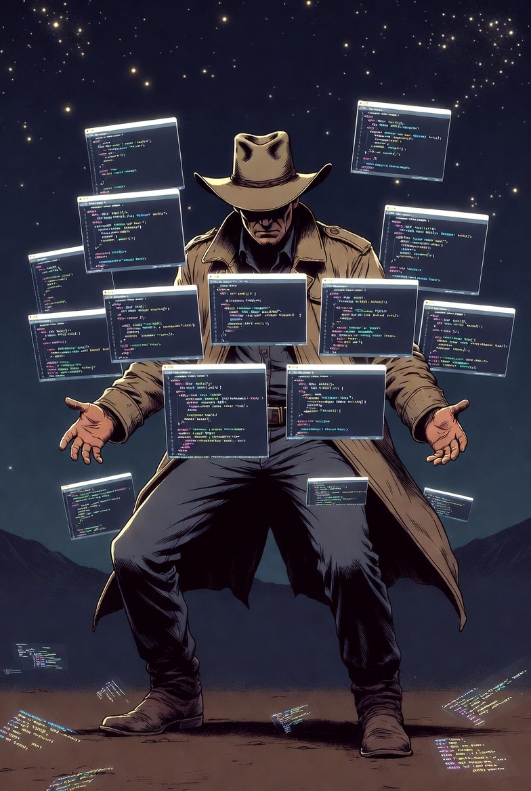

<!-- SLIDE: Title -->

  <!-- Animated gradient background -->
  

  <!-- Glowing orb behind logo -->
  

  <!-- Logo with glow effect -->
  

    

      
    

    
  

  <!-- Title with gradient text -->
  <h1 class="!text-5xl !font-bold !mt-8 bg-gradient-to-r from-orange-400 via-red-400 to-purple-400 bg-clip-text text-transparent relative z-10">
    Module 0: The Challenge
  </h1>

  <!-- Subtitle with accent -->
  

    
      ⏰ Building FanHub in 8 Hours
    
  

  <!-- Quote -->
  

    "Prove that AI-assisted development is worth the hype by building something real. Fast."
  

  <!-- Decorative line -->
  

---

<!-- SLIDE: 🛠️ Before We Start -->

🛠️ Before We Start

What you'll need

🐙

GitHub account with Copilot access

Individual, Business, or Enterprise — any tier works

💻

VS Code + GitHub Copilot extension

Enable agent mode in settings if not already on

📦

Git + local stack (node/dotnet/java/go)

For running the FanHub starter app locally

🔗

FanHub starter repo cloned

Link in the Reference Material slide at the end

What we'll cover

00
Orientation — the challenge, the team, the mindset shift

01
Instructions — teaching Copilot your repo's conventions

02
Agent Plan Mode — structured thinking before doing

03
Custom Prompts — turning repeatable work into reusable assets

04
Agent Skills — encoding domain knowledge Copilot can load

05
MCP Servers — connecting agents to real tools and data

06
Custom Agents — pulling it all together autonomously

Difficulty

⭐⭐⭐

Moderate

Hands-on

⭐⭐⭐⭐

Build as you learn

Payoff

⭐⭐⭐⭐⭐

Worth every hour

Relevance

⭐⭐⭐⭐⭐

If you use Copilot today

---

<!-- SLIDE: Meet The Team -->

👥 Meet The Team

  
👩‍🦰

  
Sarah

  
Senior Dev · 15 years

  
— drily skeptical —

  
"I've outlasted three 'revolutionary' tools this decade. I'll believe it when my PR review time drops."

  
🔧

  
Marcus

  
DevOps Dev · 5 years

  
— chronically distracted —

  
"Sorry — I was half-reading a Hacker News thread about this. What were you saying?"

  
👨‍💻

  
David

  
Staff Engineer · 20 years

  
— pleasantly pedantic —

  
"I'm not afraid of being replaced. I'm afraid of being the last person in the room who can tell good code from code that merely passes the tests."

  
🧪

  
Elena

  
QA Engineer · 8 years

  
— professionally suspicious —

  
"My job is finding what breaks. I'm going to need edge cases. Lots of them."

  
📱

  
Rafael

  
Product Manager · 10 years

  
— smoothly disengaged —

  
"I'm already mapping this to an OKR. Can we circle back to the 'how' after?"

  
🎓

  
Jessica

  
Junior Dev · 1 year

  
— quietly terrified —

  
"I'm nodding along but internally I'm Googling half the words. Is that normal? Please say yes."

---

<!-- SLIDE: Story -->

⏰ : Monday, 9:00 AM

"

A contractor bailed halfway through a generic fan site. Pick your favorite show and turn this into your fan hub — you have until end of day, and you're all using GitHub Copilot.

"

👩‍💼

Sarah needs proof

Fifteen years of hype cycles. She'll commit when the output speaks for itself — not before.

🔧

Marcus wants to ship

He builds infrastructure, not apps. Today he'll use Copilot to go further than he normally could alone.

👨‍💻

David fears generic output

Senior engineer, high standards. His concern: AI that doesn't know their patterns will make things worse.

The answer to all three concerns is the same: configuration.

Modules 1–6 show exactly how to teach Copilot your team, your codebase, and your standards.

---

<!-- SLIDE: The Mission -->

🎯 The Mission

  

    Build every layer of a Copilot-native workflow — on a real, running app
  

  

    Eight hours. Six modules. Skills you'll use tomorrow.
  

  

    
✅ By End of Day

    <ul class="text-gray-300 space-y-1 text-xs">
      <li>✓ Copilot fully briefed on your codebase</li>
      <li>✓ App converted to your team's chosen show</li>
      <li>✓ Reusable prompt files for common tasks</li>
      <li>✓ Agent skills that validate data &amp; build features</li>
      <li>✓ Live context piped in via MCP servers</li>
      <li>✓ Custom agents that plan and execute independently</li>
    </ul>
  

  

    
🎨 Your Choice

    

      
Pick your favorite show:

      

        • 📎 The Office  • 🔦 Stranger Things 
        • 🧪 Breaking Bad  • 🛡️ The Mandalorian 
        • 🐉 Game of Thrones  • 🚀 The Expanse
      

    

  

&ldquo;Wait &mdash; eight hours? I thought this was a lunch thing.&rdquo;
&mdash; Marcus

---

<!-- SLIDE: Before We Build -->

Before We Build Anything

<h1 class="text-4xl font-bold text-white mb-3">Three ideas worth carrying into everything else today</h1>

The workshop will teach you <em>how</em> to use GitHub Copilot. These slides are about <em>why it works the way it does</em> &mdash; and who you&rsquo;re becoming in the process.

🌍

The Evolution Arc

Where developers have been, where they&rsquo;re going, and where today fits in that arc.

🧠

The Mindset Shift

The single biggest change in how you think about your work &mdash; and why it unlocks everything else.

🔑

The 5 Principles

Five patterns that show up in every module. Learn them once &mdash; they compound all day.

---

<!-- SLIDE: Our Evolution -->

🌍 Our Evolution

  

    

      

      
    

    

      

        

        1990 – 2015
        

      

      
Syntax Wizards

      <ul class="text-xs text-gray-400 space-y-1 flex-1">
        <li class="flex items-center gap-1.5">▸ Memorize language quirks</li>
        <li class="flex items-center gap-1.5">▸ Clever, unreadable code</li>
        <li class="flex items-center gap-1.5">▸ Knowledge hoarding</li>
        <li class="flex items-center gap-1.5">▸ Fast typing above all</li>
      </ul>
      

        ✗ Onboarding took months
      

    

  

  

    

      

      
    

    

      

        

        2015 – 2020
        

      

      
YAML Cowboys

      <ul class="text-xs text-gray-400 space-y-1 flex-1">
        <li class="flex items-center gap-1.5">▸ Configuration as code</li>
        <li class="flex items-center gap-1.5">▸ Infrastructure everywhere</li>
        <li class="flex items-center gap-1.5">▸ Copy-paste engineering</li>
        <li class="flex items-center gap-1.5">▸ Tool proliferation</li>
      </ul>
      

        ✗ YAML bugs broke deploys
      

    

  

  

    

      

      
    

    

      

        

        2020 – Present
        

      

      
Markdown Whisperers

      <ul class="text-xs text-gray-300 space-y-1 flex-1">
        <li class="flex items-center gap-1.5">✓ <strong class="text-white">Clear intent</strong> over syntax</li>
        <li class="flex items-center gap-1.5">✓ <strong class="text-white">Understandable</strong> over clever</li>
        <li class="flex items-center gap-1.5">✓ <strong class="text-white">Scaled knowledge</strong> via docs</li>
        <li class="flex items-center gap-1.5">✓ <strong class="text-white">Fast thinking</strong> over fast typing</li>
      </ul>
      

        ✓ Copilot handles syntax — you handle judgment
      

    

  

  💡 <strong class="text-orange-300">Markdown is the medium</strong> — the best teams will be those with the best prose, not the most elegant syntax

---

<!-- SLIDE: Mindset Shift -->

🧠 The Mindset Shift

Three ways yesterday's work means something different now. 
None of them require starting over.

Memory &rarr; Judgment

Knowing the right API used to be your edge.

Knowing when Copilot&rsquo;s answer is <em>wrong</em> is your edge now. That takes everything you&rsquo;ve built.

Typing Speed &rarr; Thinking Speed

The bottleneck used to be your hands.

The bottleneck moved upstream. The constraint now is how fast you can think clearly &mdash; and how precisely you can say what you mean.

Knowledge Hoarding &rarr; Knowledge Scaling

Your expertise used to live in your head.

Now it lives in your docs &mdash; and Copilot runs on it. Writing things down stopped being overhead. It became leverage.

&ldquo;I thought being junior meant I had to prove I knew as much as David. Apparently I just have to think clearly and write things down. I can do that.&rdquo;
&mdash; Jessica

---

<!-- SLIDE: Principle 1 — Clarity Over Cleverness -->

🔑 The 5 Principles

1 of 5

🔍 Clarity Over Cleverness

Clear thinking enables effective Copilot collaboration. If I  can't explain it plainly to a human, I can't prompt it effectively to AI. The quality of the output starts with the quality of my thinking.

↩ Move Away From

• "Elegant" complexity for its own sake

• Obscure variable names and patterns

• Code written to impress, not communicate

→ Move Toward

• Simple, named, readable prompts and code

• Explaining your intent before the solution

• Asking "can I explain this plainly?"

⚡ Move Against

• The instinct to show technical depth

• One-liners that "work" but can't be read

• Complexity as a proxy for competence

&ldquo;I thought being junior meant I had to prove I knew as much as David. Apparently I just have to think clearly and write things down. I can do that.&rdquo;
&mdash; Jessica

---

<!-- SLIDE: Principle 2 — Intent Over Implementation -->

🔑 The 5 Principles

2 of 5

🎯 Intent Over Implementation

Describe WHAT outcome I need, not HOW to build it. My expertise is knowing what to build and what constraints matter — not prescribing the architecture without understand the problem.

↩ Move Away From

• Describing implementation steps in prompts

• Prescribing the solution before the goal

• Micromanaging the AI's approach

→ Move Toward

• Goals, constraints, and success criteria

• "Here's what done looks like" framing

• Letting Copilot choose the path to your goal

⚡ Move Against

• Prescribing architecture before the problem

• Over-specifying when the goal is clear

• Treating Copilot like a compiler, not a collaborator

&ldquo;I&rsquo;ve been asking engineers to lead with outcomes for a decade. They kept giving me architecture diagrams. Now there&rsquo;s a principle about it. I feel vindicated and also tired.&rdquo;
&mdash; Rafael

---

<!-- SLIDE: Principle 3 — Documentation as Leverage -->

🔑 The 5 Principles

3 of 5

📚 Documentation as Leverage

Write once, benefit infinitely. Good documentation sharpens Copilot's output and scales my team's knowledge simultaneously. Every doc I write is a force multiplier — for humans and for Copilot.

↩ Move Away From

• "I'll document it later"

• Tribal knowledge that lives in Slack

• Docs that are out of date by default

→ Move Toward

• Docs as a first-class workflow artifact

• Architecture, decisions, and patterns in files

• Writing for Copilot as well as teammates

⚡ Move Against

• Knowledge that only lives in someone's head

• Teams that can't onboard without the expert

• Context that disappears when people leave

&ldquo;Every doc I don&rsquo;t write becomes a Slack thread I answer seventeen times. I just never did the math on that before.&rdquo;
&mdash; Marcus

---

<!-- SLIDE: Principle 4 — Dialogue, Not Delegation -->

🔑 The 5 Principles

4 of 5

🔄 Dialogue, Not Delegation

Copilot works best as a conversation partner, not a one-shot task runner. Start rough, iterate, refine. The instinct to write one perfect prompt is understandable — but good results come from dialogue, not dictation.

↩ Move Away From

• Writing one massive prompt and waiting

• Giving up when the first result is rough

• Treating every session as a fresh start

→ Move Toward

• Start rough, refine in conversation

• Build shared context across a session

• Talk to Copilot as a coworker, not a tool

⚡ Move Against

• Treating Copilot as a one-shot task executor

• Blaming the model when iteration would fix it

• Expecting perfection without conversation

&ldquo;I kept rewriting the prompt from scratch every time it was wrong. I thought asking again meant I didn&rsquo;t know what I was doing. Turns out that&rsquo;s just the method.&rdquo;
&mdash; Jessica

---

<!-- SLIDE: Principle 5 — Validate, Don't Automate -->

🔑 The 5 Principles

5 of 5

⚖️ Validate, Don't Automate

Copilot proposes; I decide. My expertise catches what Copilot misses. The goal is amplification, not replacement — every output is a proposal that earns its place by surviving my judgement.

↩ Move Away From

• Accepting output without critical review

• Shipping Copilot-generated code unread

• Assuming confidence = correctness

→ Move Toward

• Every suggestion earns its place

• Your domain expertise as the quality filter

• Review as a skill, not a bottleneck

⚡ Move Against

• Automation that removes human judgment

• Speed as a reason to skip review

• Delegating architectural decisions to AI

&ldquo;I don&rsquo;t accept output I haven&rsquo;t validated. I never have &mdash; for developers, for pipelines, or for AI. This isn&rsquo;t a special rule I invented for Copilot. It&rsquo;s just the rule.&rdquo;
&mdash; Elena

---

<!-- SLIDE: Customization Map -->

🗺️ The Customization Map

  Five ways to customize GitHub Copilot—learn when to use what

  
📚

  
Repo Instructions

  
Project README for AI

  
copilot-instructions.md

  
Always on

  
📋

  
Custom Instructions

  
File-specific rules

  
*.instructions.md

  
By file pattern

  
⚡

  
Prompts

  
Task template

  
*.prompt.md

  
When invoked

  
🤖

  
Agents

  
Specialist persona

  
*.agent.md

  
@ mentioned

  
🎓

  
Skills

  
Domain expert

  
SKILL.md

  
Auto-loaded

  

    "I need Copilot to understand our conventions and constraints..."
    📚 Repo Instructions
  

  

    "My test files need different rules than my source..."
    📋 Custom Instructions
  

  

    "We do this same task every sprint..."
    ⚡ Prompts
  

  

    "I want a reviewer that only knows our patterns..."
    🤖 Agents
  

  

    "Copilot keeps guessing at our domain model..."
    🎓 Skills
  

---

<!-- SLIDE: Exercise Roadmap -->

🔨 Exercise Roadmap

<table class="text-xs w-full">
  <thead>
    <tr class="bg-gray-800">
      <th class="p-2 text-left">#</th>
      <th class="p-2 text-left">Exercise</th>
      <th class="p-2 text-left">Lead</th>
      <th class="p-2 text-center">Time</th>
      <th class="p-2 text-left">What You'll Do</th>
    </tr>
  </thead>
  <tbody>
    <tr class="bg-gray-900/50">
      <td class="p-2 font-bold text-orange-400">0.1</td>
      <td class="p-2">Clone FanHub &amp; Pick Your Stack</td>
      <td class="p-2">All ⭐</td>
      <td class="p-2 text-center">10 min</td>
      <td class="p-2 text-gray-400">Clone MSBart2/FanHub, pick your language flavor, get the app running locally</td>
    </tr>
    <tr class="bg-gray-900/30">
      <td class="p-2 font-bold text-orange-400">0.2</td>
      <td class="p-2">Experience "The Struggle"</td>
      <td class="p-2">All ⭐</td>
      <td class="p-2 text-center">15 min</td>
      <td class="p-2 text-gray-400">Build with unconfigured Copilot—feel the pain</td>
    </tr>
    <tr class="bg-gray-900/50">
      <td class="p-2 font-bold text-orange-400">0.3</td>
      <td class="p-2">Master Context Variables</td>
      <td class="p-2">All ⭐</td>
      <td class="p-2 text-center">10 min</td>
      <td class="p-2 text-gray-400">Learn #file, @workspace, #codebase, #fetch, images</td>
    </tr>
  </tbody>
</table>

  
💡 Exercise 0.2 is Critical

  

    Copilot without any customizations <strong>will be frustrating</strong>, no matter the model we choose. Here's our chance to feel the pain of someone who just <em>types a prompt and hopes for the best</em>. Suffering or laughing here will make the rest of the workshop make an impact.
  

---

<!-- SLIDE: Before & After -->

❌ The "Before"

  
What You'll Experience

  <ul class="text-sm text-gray-300 space-y-2">
    <li>❌ Generic suggestions</li>
    <li>❌ Wrong architectural patterns</li>
    <li>❌ Show-generic content</li>
    <li>❌ Inconsistent styles</li>
    <li>❌ Multiple failed attempts</li>
  </ul>

  
💭 Team Reactions

  

    
<strong>Marcus:</strong> "Fighting with autocomplete..."

    
<strong>Jessica:</strong> "Am I using it wrong?"

    
<strong>Sarah:</strong> "Generic garbage."

    
<strong>David:</strong> "Copilot doesn't know our patterns."

  

✨ The Promise

  
After Configuration

  <ul class="text-sm text-gray-300 space-y-2">
    <li>✅ Context-aware suggestions</li>
    <li>✅ Follows your architecture</li>
    <li>✅ Show-specific content</li>
    <li>✅ Consistent patterns</li>
    <li>✅ First-try success</li>
  </ul>

  
The Transformation

  

    From frustration to flow. 
    From generic to domain-specific. 
    From guessing to understanding.
  

---

<!-- SLIDE: Success Metrics -->

📊 Success Metrics

  By the end of Module 0, we'll have...

  

    

      
🎯

      

        
Environment Ready

        
FanHub running locally

      

    

  

  

    

      
📺

      

        
Show Selected

        
Your fan site theme chosen

      

    

  

  

    

      
😤

      

        
Frustration Felt

        
Experienced generic AI struggles

      

    

  

  

    

      
🧠

      

        
Mindset Shifted

        
5 principles internalized

      

    

  

  

    Ready to see everything change in <strong class="text-blue-400">Module 1</strong>
  

---

<!-- SLIDE: The Compounding Effect -->

🔗 The Compounding Effect

Each layer unlocks the next — and makes every previous layer smarter

  

    📚
    

      Module 1: Instructions
      →
      Project-wide context &amp; standards
    

    foundation
  

  

    🧠
    

      Module 2: Agent Plan Mode
      →
      Structured thinking before coding
    

    +reasoning
  

  

    ⚡
    

      Module 3: Custom Prompts
      →
      Reusable, context-aware templates
    

    +recall
  

  

    🛠️
    

      Module 4: Agent Skills
      →
      Domain-specific capabilities
    

    +expertise
  

  

    🔌
    

      Module 5: MCP Servers
      →
      Live data &amp; external context
    

    +livedata
  

  

    🤖
    

      Module 6: Custom Agents
      →
      Specialist AI teammates
    

    ✨ full power
  

---

<!-- SLIDE: Exercises Hero -->

🔨 Exercises &mdash; Orientation

4 exercises &middot; ~40 minutes &middot; everyone leads

0.1 &mdash; Clone FanHub

Sarah ⭐

Get the app running locally. Explore the codebase before Copilot knows anything about it.

Establish your baseline &rarr; know what you&rsquo;re working with

0.2 &mdash; The Struggle

Jessica ⭐

Use Copilot cold — no instructions, no context setup. Notice what it gets wrong and why.

Feel the problem before you solve it

0.3 &mdash; Context Fundamentals

Elena ⭐

Explore what Copilot actually sees. Learn the difference between what you think it knows and what it knows.

Context isn&rsquo;t assumed &mdash; it&rsquo;s constructed

0.4 &mdash; Success Metrics

Rafael ⭐

Define what &ldquo;better&rdquo; looks like for your team. Set a baseline you can measure against at the end of the day.

If you can&rsquo;t measure it, you can&rsquo;t know it worked

&ldquo;I asked Copilot to explain the codebase. It gave me a confident answer about files that didn&rsquo;t exist. That was exercise 0.2. It was extremely educational.&rdquo;
&mdash; Jessica

---

<!-- SLIDE: Exercise 0.1 -->

  

  <!-- Header -->
  

    
0.1

    

      
Exercise

      <h2 class="!text-2xl !font-bold text-white !m-0">Clone FanHub & Pick Your Stack</h2>
    

    

      Everyone ⭐
      ⏱ 10 min
    

  

  <!-- Story -->
  

    Sarah drops the challenge. Before Copilot can help, it needs a codebase. <strong class="text-white">First things first: get the repo.</strong>
  

  <!-- Steps + Success in two columns -->
  

    

      
📋 Steps

      

        1
        
git clone https://github.com/MSBart2/FanHub.git

      

      

        2
        
Browse language folders, pick the one that matches your background

      

      

        3
        
Pick your show — 📺 The Office · 🔦 Stranger Things · 🧪 Breaking Bad · 🛡️ Mandalorian

      

      

        4
        
Install deps, start frontend/backend (2 terminals), confirm the starter UI loads

      

      

        5
        
Open in VS Code — confirm GitHub Copilot is active in the status bar

      

    

    

      
✅ Success Criteria

      

        
☐ Repo cloned successfully

        
☐ Language flavor chosen

        
☐ App running locally

        
☐ VS Code + Copilot active

      

      

        💭 <strong class="text-orange-300">Jessica:</strong> "I don't need to know the whole codebase — just enough to start asking good questions."
      

    

  

---

<!-- SLIDE: Exercise 0.2 -->

  

  <!-- Header -->
  

    
0.2

    

      
Exercise

      <h2 class="!text-2xl !font-bold text-white !m-0">Experience "The Struggle"</h2>
    

    

      Everyone ⭐
      ⏱ 15 min
    

  

  <!-- Warning banner -->
  

    ⚠️ <strong>This exercise is intentionally frustrating.</strong> It helps to feel the "before" state to appreciate the transformation. Do not skip it.
  

  

    

      
📋 Steps

      

        

          1
          Browse the FanHub code — schema, routes, components. Find the docs folder. It's empty.
        

        

          2
        
Copilot, add a character detail page to FanHub

        

        

          3
          Note every frustration: wrong language, patterns, generic names, inconsistent style, multiple failed attempts
        

      

    

    

      
❌ You'll Experience

      

        
Generic suggestions that don't match your architecture

        
Confidently incorrect patterns/syntax 

        
Inconsistent code styles (because the codebase is inconsistent)

        
Multiple failed attempts to get what you actually want

      

      

        💭 <strong class="text-purple-300">Sarah:</strong> "Generic garbage. This is exactly what I expected."
      

    

  

---

<!-- SLIDE: Exercise 0.3 -->

  

  <!-- Header -->
  

    
0.3

    

      
Exercise

      <h2 class="!text-2xl !font-bold text-white !m-0">Context Fundamentals</h2>
    

    

      Everyone ⭐
      ⏱ 10 min
    

  

  <!-- Story -->
  

    Marcus asks Copilot a basic question. It responds with a generic answer because it cannot see the project file he actually means. <strong class="text-white">Context is everything.</strong>
  

  <!-- 5 mechanisms + success -->
  

    

      
📋 Try Each Mechanism

      

        

          Known file context
          Explain how this project is structured. #file:README.md
        

        

          Project overview
          @workspace how is this application organized?
        

        

          Semantic search
          #codebase where does this project handle routing?
        

        

          Visual context
          Copy/Paste/Drag a screenshot or mockup directly into chat
        

      

    

    

      
✅ Success Criteria

      

        
☐ Tried at least 3 of the 5 mechanisms

        
☐ Noticed difference in response quality

        
☐ Ready to use context throughout the workshop

      

      

        💭 <strong class="text-red-300">Marcus:</strong> "I asked without context, it answered without context, and I was annoyed. Then I added @workspace. Completely different answer. I was the problem. This time."
      

    

  

---

<!-- SLIDE: Exercise 0.4 -->

  

  <!-- Header -->
  

    
0.4

    

      
Exercise

      <h2 class="!text-2xl !font-bold text-white !m-0">Set Your Success Metrics</h2>
    

    

      Everyone ⭐
      ⏱ 10 min
    

  

  <!-- Story -->
  

    David stops mid-conversation. <em>&ldquo;Hold on &mdash; we haven&rsquo;t defined what success looks like. I&rsquo;m not spending eight hours without a measurable outcome.&rdquo;</em> <strong class="text-white">He&rsquo;s not wrong.</strong>
  

  

    

      
📋 Steps

      

        

          1
          Scan the Old &rarr; New metrics. Pick 2&ndash;3 that feel true about how you measure yourself today.
        

        

          2
          For each one, ask honestly: <em>&ldquo;Is this still the right thing to measure?&rdquo;</em>
        

        

          3
          Pick one you want to be different by the end of module 6.
        

        

          4
          Hold it in mind &mdash; no need to write it down. You&rsquo;ll know if it shifted.
        

      

    

    

      
📊 Old → New Metrics

      

        

          
Lines of code / day

          
Features shipped / week

        

        

          
Memorized API signatures

          
Clarity of intent in prompts

        

        

          
Being the only expert

          
Knowledge scaled to the team

        

        

          
Fast typing

          
Fast design thinking

        

      

      

        💭 <strong class="text-yellow-300">David:</strong> "My 20 years of experience isn't obsolete — it's the quality filter."
      

    

  

---

<!-- SLIDE: 💭 The Team, After Orientation -->

💭 The Team, After Orientation

Jessica

The Eager Junior

&ldquo;I thought this was going to be different. It answered questions about a completely different codebase. I&rsquo;m nodding along but I&rsquo;m genuinely confused about what just happened.&rdquo;

Still nodding. Not sure why.

David

The Seasoned Architect

&ldquo;It produced three incorrect file paths with complete confidence. I have significant questions about the epistemology of this system.&rdquo;

The questions are not rhetorical.

Sarah

The Skeptical Senior

&ldquo;I&rsquo;ve seen tools that don&rsquo;t work. This is a tool that doesn&rsquo;t work yet. I&rsquo;m not sure that&rsquo;s a better problem.&rdquo;

Holding judgment. Barely.

Elena

The Quality Champion

&ldquo;It invented an API endpoint. Confidently. Without hesitation. I&rsquo;m going to need a minute before I continue.&rdquo;

The minute is not going well.

Marcus

The DevOps Developer

&ldquo;It gave me completely wrong information and seemed fine about it. I don&rsquo;t know if that&rsquo;s a me problem or an it problem. I&rsquo;m not happy either way.&rdquo;

Back to Slack. Temporarily.

Rafael

The Product Visionary

&ldquo;I asked a simple question. I got a confident answer about a product that doesn&rsquo;t exist. Someone is going to need to explain the ROI on &lsquo;confident but wrong.&rsquo;&rdquo;

ROI calculation: pending.

---

<!-- SLIDE: Next Up -->

➡️ Next Up

  
Coming Up Next

  
Module 1: Instructions

  
Sarah and David establish the foundation that makes everything else possible

  

    ⏰ 10:00 AM
    ·
    📚 copilot-instructions.md
    ·
    ✨ Same code, better AI
  

  

    
M1

    
Instructions

  

  
›

  

    
M2

    
Plan Mode

  

  
›

  

    
M3

    
Prompts

  

  
›

  

    
M4

    
Skills

  

  
›

  

    
M5

    
MCP

  

  
›

  

    
M6

    
Agents

  

  ⚠️
  

    
Don't Skip Exercise 0.2

    
The transformation only matters if you experience the problem first

  

  

    
📦 You'll build

    

      
→ ARCHITECTURE.md — project context for AI

      
→ .github/copilot-instructions.md

      
→ Path-scoped .instructions.md files

    

  

  

    
✨ You'll see

    

      
→ Copilot go from generic to project-aware

      
→ PR corrections start to disappear

      
→ The baseline that makes every later module smarter

    

  

---

<!-- SLIDE: Thank You -->

  <!-- Background gradient -->
  

  <!-- Radial glow -->
  

  <!-- Logo -->
  

    

      
    

    
  

  <!-- Headline -->
  <h1 class="!text-5xl !font-bold !mb-4 bg-gradient-to-r from-orange-400 via-red-400 to-purple-400 bg-clip-text text-transparent relative z-10">
    The 8-Hour Challenge Begins
  </h1>

  <!-- Pill subtitle -->
  

    
      🚀 Module 0: Orientation — Complete
    
  

  <!-- 3-column action cards -->
  

    

      
📺

      
Pick Your Show

      
Choose your fan hub theme

    

    

      
😤

      
Feel the Struggle

      
Exercise 0.2 — don't skip it

    

    

      
✨

      
Then Transform

      
Module 1 changes everything

    

  

  <!-- Decorative line -->
  

