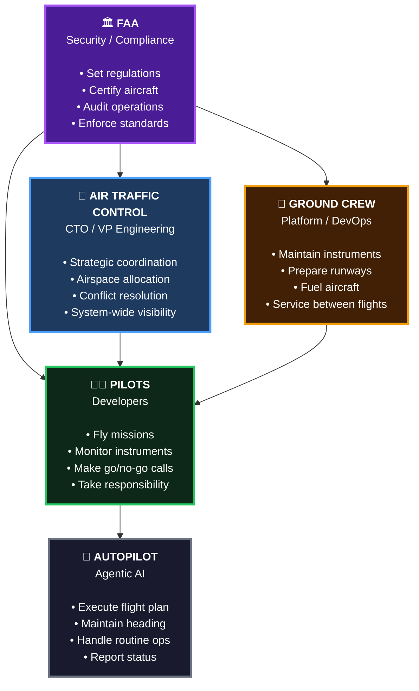

# Agentic Delivery Brief

*An executive briefing for decision-makers authorizing AI investment*

---

## The Shift: From Coders to Captains

AI is already changing software delivery at measurable scale. Enterprise teams using GitHub Copilot complete tasks 55% faster (GitHub/Microsoft Research, 2022). A 2024 randomized controlled trial with Accenture documented 84% more successful builds and 70% less mental effort on repetitive tasks—at production scale, across real codebases (GitHub + Accenture, 2024). Enterprise-validated productivity uplifts of 20–45% are documented across organizations (McKinsey Digital, 2023). Organizations that have invested in agentic infrastructure are 18–24 months into building the institutional muscle memory that enables compounding returns.

The central question for enterprise leaders is whether an organization can capture this change safely. AI-enabled speed at enterprise scale requires governance infrastructure that makes speed sustainable—compliance gates, security automation, observability. The organizations capturing the full multiplier are those that invested in the instrument panel alongside the AI.

**Developers in the agentic model become captains.**

Consider what a commercial airline pilot actually does. They don't hand-fly the aircraft for most of the journey. Modern aircraft have sophisticated autopilot systems that handle altitude, heading, speed, and even landing in low-visibility conditions. The autopilot does the mechanical work of flying.

But no one suggests we don't need pilots.

The question for enterprise leaders: **Are developers equipped to fly? And does the organization have the system around them to fly safely?**

---

## The System: How Flight Operations Work

Before we zoom into the cockpit, let's understand the entire system that makes flight possible. Aviation isn't just pilots and planes—it's a coordinated ecosystem where every role is essential.

*Caption: The Complete Flight Operations System — Every role is essential. Pilots command the autopilot, but they can't fly without ground crew maintaining their instruments, ATC coordinating the airspace, and the FAA setting the rules.*

### 🤖 Autopilot → Agentic AI

The autopilot doesn't replace the pilot—it handles the mechanical work of flying so the pilot can focus on judgment, decision-making, and responsibility.

In software delivery, **agentic AI is the autopilot**. It executes the flight plan, handles routine operations like testing and refactoring, and reports status—all without the pilot touching the controls during cruise. Powerful, and only safe with a pilot who knows when to intervene.

Autopilot without a pilot is just an expensive way to crash.

### 👨‍✈️ Pilots → Developers

Developers become **flight captains**: they plan the mission, make go/no-go calls, monitor instruments during cruise, intervene when something goes wrong, and take responsibility for every deployment. The role is accountable decision-maker—with AI handling the mechanical work of execution.

This is exactly what developers become in an agentic world.

### 🗼 Air Traffic Control → CTO / VP Engineering

In an agentic world, the CTO/VP Engineering role intensifies. With developers flying multiple concurrent AI sessions, coordination complexity compounds. ATC coordinates missions, allocates resources, resolves conflicts between teams, and maintains fleet-wide visibility. The value of technical leadership grows precisely when the pace of delivery grows.

### 🔧 Ground Crew → Platform / DevOps

Platform and DevOps teams are the force multiplier behind the multiplier. They build and operate the instrument panel—dashboards, pipelines, automated gates—that make agentic sessions safe to supervise. In the agentic model, platform investment is not overhead; it is the infrastructure that determines whether AI investment returns value or creates risk.

The ground crew's work is invisible when it's done well. But without them, pilots have no instruments, no runways, and no fuel.

### 🏛️ FAA → Security / Compliance

Security and compliance teams set the rules that make agentic speed sustainable. They define what "green" looks like on the compliance instrument, approve the patterns AI is permitted to use, and enforce the gates that block unsafe code before it reaches production. In an agentic delivery model, automated enforcement by the security function is what separates "move fast" from "move recklessly." The NIST AI Risk Management Framework (2023) provides the governance vocabulary for structuring these controls across procurement, deployment, and ongoing monitoring.

---

*Now let's zoom into the cockpit and see what pilots actually work with.*

---

## The Developer Instrument Panel

Every pilot learns the "six-pack"—the six primary flight instruments that provide essential situational awareness. These instruments tell the pilot: Am I climbing or descending? Am I turning? Am I going the right speed? Am I at the right altitude? Will I arrive where I intend to go? And am I safe to continue?

Without these instruments, a pilot in clouds is flying blind. Spatial disorientation sets in within seconds. Accidents follow within minutes.

Developers flying agentic missions need their own "Six Pack". These are the instruments that answer: Is this code safe to ship? Is it legal to deploy? Will it perform? Can we roll it back?

```mermaid
flowchart TB
    subgraph cockpit["🎛️ DEVELOPER INSTRUMENT PANEL                    "]
        direction TB
        subgraph row1[" "]
            direction LR
            test["🧪 TEST HEALTH<br/>━━━━━━━━━━<br/>Coverage: 94%<br/>Passing: 847/847<br/>🟢 ALL CLEAR"]
            security["🔒 SECURITY<br/>━━━━━━━━━━<br/>Critical: 0<br/>High: 0<br/>🟢 CLEAN SCAN"]
            perf["⚡ PERFORMANCE<br/>━━━━━━━━━━<br/>P95: 142ms<br/>Baseline: 150ms<br/>🟢 WITHIN BOUNDS"]
        end
        subgraph row2[" "]
            direction LR
            compliance["📋 COMPLIANCE<br/>━━━━━━━━━━<br/>SOC2: Clean<br/>FedRAMP: Clean<br/>🟢 ATTESTED"]
            deploy["🚀 DEPLOY WINDOW<br/>━━━━━━━━━━<br/>Status: Open<br/>Next freeze: 14d<br/>🟢 CLEAR"]
            deps["📦 DEPENDENCIES<br/>━━━━━━━━━━<br/>CVEs: 0<br/>Updates: 2 minor<br/>🟢 HEALTHY"]
        end
    end

    style cockpit fill:#1a1a2e,stroke:#4a9eff,stroke-width:2px
    style test fill:#0d2818,stroke:#22c55e,stroke-width:2px
    style security fill:#0d2818,stroke:#22c55e,stroke-width:2px
    style perf fill:#0d2818,stroke:#22c55e,stroke-width:2px
    style compliance fill:#0d2818,stroke:#22c55e,stroke-width:2px
    style deploy fill:#0d2818,stroke:#22c55e,stroke-width:2px
    style deps fill:#0d2818,stroke:#22c55e,stroke-width:2px
```

*Caption: Developer Instrument Panel — The six readings that determine flight readiness. All green means cleared for deployment. Any red grounds the flight.*

Each instrument provides a single traffic-light reading (green/yellow/red) aggregated into a unified dashboard. Here is what each measures and why it matters at the leadership level:

### 🧪 Test Health

Automated test results verify that AI-generated code does what was intended. A green panel means the developer can proceed with confidence. Red grounds the flight—no deployment until resolved. Without this instrument, there is no reliable signal that agentic output is correct.

### 🔒 Security Posture

Automated vulnerability scanning runs against every line AI produces and gates deployment on a clean result. The average enterprise data breach cost $4.88M at its 2024 peak (IBM Cost of a Data Breach Report, 2025); organizations using AI-assisted security detection spent $2.2M less on average. Automated security gates are the most cost-effective line in an organization's risk budget.

### ⚡ Performance Baseline

Automated comparison against production benchmarks catches regressions before they ship. AI can produce functionally correct code that silently degrades user experience under load\u2014this instrument catches that before it reaches customers. Silent degradation surfaces first in customer churn metrics and support volume, well before it is visible in engineering dashboards.

### 📋 Compliance Gates

Automated policy checks verify every change against active compliance frameworks—SOC2, HIPAA, FedRAMP, GDPR, and others. Since 2023, the SEC requires material cybersecurity incident disclosure within 4 business days. Compliance automation is a board governance control that runs on every commit.

### 🚀 Deployment Window

Change management policies are surfaced as a real-time gate. Agentic sessions can produce deployable code at any hour; deployment windows enforce organizational risk policy automatically. The instrument prevents AI from shipping code during periods the change management process has designated as high-risk—without requiring human intervention to enforce it.

### 📦 Dependency Health

Automated supply chain scanning validates every package AI introduces against known vulnerabilities. The SolarWinds and Log4j incidents demonstrated what supply chain compromise costs enterprises: tens of millions in direct recovery, plus regulatory and reputational fallout. This gate prevents AI from importing risk the organization has not explicitly approved.

---

## Sourcing the Instrument Panel: Build vs. Buy

When authorizing the instrument panel build-out, a practical question is what to purchase versus what to build in-house. The split follows a consistent pattern across organizations:

| Instrument | Commercial Options | Platform Engineering Work |
|---|---|---|
| **Test Health** | GitHub Actions, CircleCI, existing CI tooling | Coverage thresholds, CI pipeline integration |
| **Security Posture** | GitHub Advanced Security, Snyk, Semgrep, Veracode | Gate criteria definition, remediation workflow, PR gating |
| **Performance Baseline** | Datadog, New Relic, Grafana | Baseline calibration, regression threshold definition |
| **Compliance Gates** | Orca Security, Prisma Cloud, custom policy engines | Policy codification, framework-specific attestation logic |
| **Deployment Window** | ServiceNow, PagerDuty, native CI/CD | Change management integration, schedule enforcement |
| **Dependency Health** | Dependabot, Snyk, OWASP Dependency-Check | Approved package registry governance, CVE triage workflow |

The general pattern: detection and scanning tooling is commercially available and mature. The platform engineering investment is in integrating that tooling into CI gates, defining policy thresholds, and ensuring every agentic session runs through the full panel automatically before deployment.

**Budget guidance:** Commercial tooling licensing for a 50-developer organization typically runs $50–150K annually. Platform engineering integration work (one-time) is $100–300K. Ongoing operating cost is primarily the platform team maintaining and calibrating the pipeline.

---

## Governance: Who Owns Each Instrument

Without explicit ownership assignments, instrument quality degrades over time — thresholds go uncalibrated, policy definitions go stale, and gates become rubber stamps. Each instrument requires a named owner accountable for calibration and a governance authority responsible for policy:

| Instrument | Primary Owner | Policy Authority |
|---|---|---|
| Test Health | Engineering leads / tech leads | VP Engineering — coverage thresholds and gate criteria |
| Security Posture | Platform / DevSecOps | CISO — CVE severity thresholds, gate-blocking policy |
| Performance Baseline | SRE / Platform Engineering | VP Engineering — SLO definitions, regression tolerance |
| Compliance Gates | Security / GRC | CISO + Legal — framework requirements, attestation scope |
| Deployment Window | Platform / Change Management | CTO / VP Engineering — freeze windows, risk criteria |
| Dependency Health | Platform Engineering | CISO — approved package registry, update cadence |

The CTO or VP Engineering holds cross-instrument visibility — responsible for the integrated health of the panel as a system, not individual instruments in isolation. This is the Air Traffic Control function: strategic coordination that becomes more critical as the number of concurrent agentic sessions grows across teams.

---

## The Flight: Phases of Agentic Delivery

A flight has distinct phases, each with different levels of automation and human involvement. Agentic software delivery follows the same pattern.

```mermaid
flowchart TB
    subgraph row1[" "]
        direction LR
        subgraph preflight["✈️ PRE-FLIGHT — Human Authority Required"]
            direction TB
            p1["📋 Check instruments"]
            p2["🗺️ File flight plan"]
            p3["⛽ Verify resources"]
            p4["✅ Go/No-go decision"]
        end

        subgraph takeoff["🛫 TAKEOFF — Human Authority Required"]
            direction TB
            t1["🎯 Define task scope"]
            t2["🤖 Initialize agent"]
            t3["📍 Set guardrails"]
            t4["▶️ Begin execution"]
        end
    end

    subgraph row2[" "]
        direction LR
        subgraph cruise["✈️ CRUISE — AI Autonomy + Human Monitoring"]
            direction TB
            c1["👁️ Monitor instruments"]
            c2["🔄 Steer as needed"]
            c3["⚠️ Handle turbulence"]
            c4["🤖 AI executes"]
        end

        subgraph landing["🛬 LANDING — Human Authority Required"]
            direction TB
            l1["✅ Verify completion"]
            l2["📊 Check all instruments"]
            l3["🔐 Attest quality"]
            l4["🚀 Deploy"]
        end
    end

    preflight --> takeoff
    takeoff --> cruise
    cruise --> landing

    style preflight fill:#1e3a5f,stroke:#4a9eff,stroke-width:3px
    style takeoff fill:#1e3a5f,stroke:#4a9eff,stroke-width:3px
    style cruise fill:#0d2818,stroke:#22c55e,stroke-width:3px
    style landing fill:#1e3a5f,stroke:#4a9eff,stroke-width:3px
    style row1 fill:transparent,stroke:transparent
    style row2 fill:transparent,stroke:transparent
```

*Caption: Agentic Delivery Lifecycle — Blue phases require human authority. Green phase is AI-autonomous with human monitoring. Humans control the boundaries; AI operates within them.*

### Pre-Flight: Human Authority Required

Before any flight, the pilot conducts a pre-flight inspection. They check the aircraft, review weather, file a flight plan, calculate fuel requirements, and make the **go/no-go decision**.

In agentic delivery, pre-flight means:

All six instruments must read green. The developer defines the task scope, acceptance criteria, and hard limits for the agent—what files can be changed, what actions are permitted, what the goal looks like when achieved. The AI has not started yet. This phase is entirely human authority establishing the conditions for a safe execution.

### Takeoff: Human Authority Required

Takeoff is the most dangerous phase of flight. The aircraft transitions from ground to air, committed to flight with limited options if something goes wrong.

In agentic delivery, takeoff means:

The developer initializes the agent with bounded instructions, specifies what files can be touched and what actions are permitted, and begins execution. Human authority governs the launch. Once the agent is airborne, the dynamic shifts.

### Cruise: AI Autonomy with Human Monitoring

Cruise is where autopilot shines. The aircraft is stable, conditions are (usually) predictable, and the mechanical work of maintaining heading and altitude is handled automatically.

In agentic delivery, cruise means:

- **AI executes** — The agent writes code, runs tests, iterates on solutions
- **Human monitors instruments** — Test status, security scans, performance benchmarks
- **Human steers as needed** — Provide clarification, redirect when off course
- **Handle turbulence** — Unexpected errors, changing requirements, new information

This is the phase where AI delivers massive value. The agent is writing code, potentially across multiple files, iterating based on test results, and making progress without the developer typing every character.

But the developer isn't idle. They're watching instruments. They're ready to intervene. They're maintaining situational awareness.

The developer who "starts an agent and walks away" is the pilot who "engages autopilot and takes a nap." It works—until it doesn't. And when it doesn't, there is no time to wake up.

### Landing: Human Authority Required

Landing is the second-most dangerous phase. The aircraft transitions from air to ground, requiring precise control and judgment.

In agentic delivery, landing means:

The developer reviews what the agent produced, confirms all six instrument readings are green, and makes the explicit decision to ship. The agent may have written the code. The developer takes responsibility for deploying it.

**No code deploys without a pilot signing off.**

---

## The Multiplier: One Pilot, Multiple Aircraft

Here's where the aviation metaphor reveals something profound about agentic AI's potential.

In aviation, one pilot flies one plane. It's a regulatory requirement, a safety constraint, and a practical reality. No human can maintain situational awareness across multiple concurrent flights.

In software development, that constraint doesn't exist.

```mermaid
flowchart TB
    pilot["👨‍✈️ DEVELOPER<br/>━━━━━━━━━━<br/>Monitoring 3 flights<br/>All instruments visible<br/>Intervention ready"]

    subgraph flights["CONCURRENT AGENTIC SESSIONS"]
        direction LR

        subgraph f1["Flight 1: Feature A"]
            a1["🤖 Agent working"]
            a2["🧪 Tests: 🟢"]
            a3["🔒 Security: 🟢"]
        end

        subgraph f2["Flight 2: Feature B"]
            b1["🤖 Agent working"]
            b2["🧪 Tests: 🟡"]
            b3["🔒 Security: 🟢"]
        end

        subgraph f3["Flight 3: Bug Fix"]
            c1["🤖 Agent working"]
            c2["🧪 Tests: 🟢"]
            c3["🔒 Security: 🟢"]
        end
    end

    pilot --> f1
    pilot --> f2
    pilot --> f3

    style pilot fill:#4a1d96,stroke:#a855f7,stroke-width:2px
    style f1 fill:#0d2818,stroke:#22c55e,stroke-width:2px
    style f2 fill:#422006,stroke:#f59e0b,stroke-width:2px
    style f3 fill:#0d2818,stroke:#22c55e,stroke-width:2px
```

*Caption: The Agentic Multiplier — One developer managing three concurrent agentic sessions. Throughput is limited by instrument monitoring capacity, not typing speed. Flight 2 shows a yellow indicator—the developer will investigate before that code lands.*

A skilled developer with good instruments can supervise multiple agentic sessions simultaneously. Not because they're typing faster, but because:

1. **Instruments aggregate status** — A dashboard showing three flights' worth of test/security/compliance status is manageable
2. **Cruise is autonomous** — While agents are executing, the developer isn't actively doing anything except monitoring
3. **Intervention is surgical** — When a developer needs to steer, it's a targeted correction, not continuous control
4. **Critical phases are sequential** — Pre-flight and landing still require focused attention, but they're bounded in time

**The limit isn't typing speed. The limit is instrument monitoring capacity.**

A developer with no instruments can barely manage one agentic session—they're constantly checking manually, losing context, and risking surprises. A developer with excellent instruments can manage three, four, maybe more concurrent flights.

This is the labor multiplier that enterprises desperately want from AI. Not "developers type faster." Not even "developers think faster." Instead: **developers can fly more missions in the same time.**

The prerequisite for multi-session flight is instrument coverage.

Supervising three agentic sessions without dashboards for test status, security scans, and compliance gates is equivalent to flying three planes in fog. The instruments exist precisely to make concurrent agentic supervision tractable. Without them, the overhead of manual verification grows faster than the productivity gain from running more sessions.

The organizations that capture the agentic multiplier are those whose developers can safely fly the most planes—because the instrument infrastructure supports it.
**Agentic infrastructure also affects talent.** The GitHub Developer Survey 2024 found that 99\u2013100% of developers say AI proficiency makes them a more attractive candidate\u2014meaning the engineers organizations most want to hire are actively evaluating whether an employer's engineering environment supports serious AI work (GitHub Developer Survey, 2024). The GitHub Octoverse 2024 confirms that developer satisfaction correlates strongly with access to AI tooling and agentic workflows. Organizations with mature instrument panels attract developers who want to operate at the frontier of agentic delivery. In a consistently tight market for senior engineering talent, that is a material recruiting and retention advantage alongside the throughput gains.
---

## No-Fly Zones: What AI Must Never Do Alone

Autopilot is powerful, but it has limits. There are conditions where the pilot must take direct control, and there are actions that autopilot simply isn't allowed to perform.

The same is true for agentic AI. Six categories of action require explicit human authorization before execution—no agent may perform these unilaterally:

- **Production database schema changes** — Schema changes at scale are irreversible. Agents propose; humans authorize and execute.
- **Security control bypasses** — No agent may skip a compliance check, disable a security gate, or defer a required scan under any circumstances.
- **Unapproved dependencies** — Every new library is a supply chain trust decision. Agents may only add dependencies from an approved list; new additions require explicit human review.
- **Production configuration changes** — Runtime configuration can alter application behavior as dramatically as code changes—often with less visibility and no rollback path. Human review required.
- **Access control modifications** — Privilege changes require human authorization. An agent that escalates its own permissions has violated the trust model that makes automation safe.
- **External system integrations** — Connecting to new external systems creates data flows, security exposures, and compliance implications that require architectural, legal, and security sign-off.

These governance controls make agentic automation auditable, insurable, and defensible to regulators and auditors. The NIST AI Risk Management Framework (2023) provides the vocabulary for structuring these controls across procurement, deployment, and ongoing monitoring. An agent that operates within these limits earns broad autonomy within them.

**The flight plan protects the flight.**

---

## Data Privacy and IP Governance

Before expanding agentic AI use, organizations need clear policy answers to three questions that Legal, Security, and GRC teams will ask\u2014and that define what agents are permitted to access.

### What data can enter an agent's context window?

Every agentic session transmits context to the AI model: code, comments, documentation, test data, and any content the agent reads to complete its task. For organizations using external AI providers, this data leaves the enterprise network. Three categories require explicit policy before agents are permitted to access them:

- **Customer PII and regulated data** \u2014 Personal health information (HIPAA), financial records (PCI-DSS, SOX), and consumer data subject to GDPR or CCPA must not reach external AI providers without explicit legal basis and data processing agreements. Policy should specify which data types are prohibited from agent context, enforced at the repository and access control level.
- **Trade secrets and unreleased IP** \u2014 Source code for unreleased products, proprietary algorithms, and competitive intelligence may carry confidentiality obligations that preclude transmission to third-party AI services. Legal review of AI provider terms against IP obligations is a prerequisite for deployment, not a follow-on item.
- **Third-party licensed code** \u2014 Agents operating on codebases with GPL, LGPL, or copyleft components may produce output that inadvertently creates license compliance obligations. A license scanning step belongs in the instrument panel for affected organizations.

### Who owns AI-generated code?

IP ownership of AI-generated output remains legally unresolved in most jurisdictions. Current US Copyright Office guidance indicates that purely AI-generated work without meaningful human authorship is not copyrightable. In practice, AI-assisted code\u2014where a developer provides significant direction and reviews the output\u2014is more likely to qualify. Organizations should establish a working policy with legal counsel and revisit it annually as case law develops.

### Private deployment for high-sensitivity workloads

Organizations in regulated industries (healthcare, finance, defense, government) should assess whether external AI provider deployment is appropriate for all workloads, or whether specific codebases require private model deployment\u2014either self-hosted open-weight models or private cloud tenants with enterprise data protection agreements. The answer varies by workload; the question should be asked explicitly for each agentic use case.

---

## The Regulatory Trajectory

The governance controls this talk recommends\u2014automated testing, security gates, compliance checks, defined human authority points\u2014align with the direction enterprise AI regulation is moving globally.

**EU AI Act (effective 2024, staged implementation through 2026):** The EU's AI regulatory framework classifies AI applications by risk tier. High-risk AI\u2014including systems that operate in critical infrastructure or make consequential decisions\u2014requires conformity assessments, transparency documentation, and ongoing monitoring (EU AI Act, 2024). Software delivery AI that gates access, reviews code for security policy, or automates compliance checking may fall in or near high-risk categories depending on industry and context. Organizations building instrument panels with audit trails, governance documentation, and defined human oversight points are building toward compliance.

**NIST AI Risk Management Framework:** Already the de facto US governance vocabulary for AI procurement and deployment, the NIST AI RMF is increasingly referenced in federal procurement requirements and is expected to inform future US AI regulation. Adopting it now establishes a foundation before requirements become mandatory.

**SEC cybersecurity disclosure requirements:** The 4-business-day material incident disclosure requirement (effective December 2023) creates organizational incentive for automated security detection: the ability to detect, characterize, and report an incident within that window requires telemetry and tooling that must exist before the incident occurs.

The common thread: regulators are converging on requiring documented governance, defined human authority, and audit capability for AI systems operating at enterprise scale. The instrument panel and pilot model are the practical delivery-team implementation of these requirements.

---

## The Enterprise Instrument Advantage

AI coding assistants are widely available. The meaningful differentiator is the instrument panel—the governance infrastructure that lets enterprises run agentic sessions safely at scale.
**For organizations that have already deployed AI coding assistants**\u2014GitHub Copilot, Cursor, or similar\u2014the instrument panel is the next investment layer. Phase 1 deployments (individual AI assistance, faster task completion) are captured at the tool level. Phase 2\u2014expanding from individual assistance to supervised autonomous agentic sessions at team scale\u2014requires the instrument infrastructure. Existing tool licenses become the pilot interface through which developers interact with agentic sessions that the instrument panel makes safe to run.
Enterprise deployments operate under a fundamentally different set of constraints than unregulated environments. Every deployment can be audited. The 2025 IBM Cost of a Data Breach Report documents that organizations using AI-assisted security detection spend $2.2M less per incident on average—a 9% reduction from the 2024 peak of $4.88M (IBM, 2025). Since 2023, the SEC requires material cybersecurity incident disclosure within 4 business days (SEC Rule 33-11216). Automated governance gates are a risk management investment with a measurable return, not just an engineering overhead.

The DORA research on ROI of AI-assisted development (2025) identifies automated testing, security scanning, and deployment governance as the infrastructure that determines whether AI investment returns value. Organizations with this infrastructure in place before expanding AI use see compounding returns; those that expand AI use without it carry compounding review overhead instead.

### Instruments unlock the multiplier.

Developers supervising three concurrent AI sessions need dashboards that aggregate test, security, and compliance status across all three. Agents iterating autonomously during cruise need automated gates that catch problems before they hit production. The GitHub + Accenture RCT found that teams with structured AI workflows—including automated verification—achieved 84% more successful builds (2024). The instrument infrastructure is what produced that result.

**The investment in instruments isn't overhead. It's what makes the multiplier real.**

The calculation is direct: a fully-loaded developer costs $150–200K annually. A developer managing three concurrent agentic sessions with good instrument coverage delivers the throughput equivalent of tripling that headcount—without tripling payroll. At a $10M engineering organization, that multiplier represents $20M in additional capacity. The platform team of 3–5 engineers that builds and operates the instrument panel is the enabling investment.

---

## Why Agentic Programs Underperform — and How to Avoid It

DORA research shows that 13–15% of AI-assisted development programs achieve projected ROI within 12 months. McKinsey QuantumBlack's 2024 analysis found that only 5% of AI pilots deliver material bottom-line improvement (McKinsey QuantumBlack, 2024). The gap between expectation and outcome is large and consistent — and the failure patterns are predictable enough to plan around.

### Pattern 1: AI before infrastructure

The most common failure sequence: AI tools are deployed, productivity gains are expected, agent output volume increases, manual review burden grows faster than productivity gain, net throughput is flat or negative, program confidence drops.

Organizations that achieve target ROI typically invert this sequence. Instrument panel first — automated verification, security gates, compliance checks — validated as reliable before AI use expands. The infrastructure is the enabling condition, not a follow-on investment.

### Pattern 2: Tribal knowledge barriers

Agents produce output based on the context they receive. Organizations where critical design decisions, service contracts, and system constraints live in people's heads rather than written documentation see two compounding problems: agent output requires extensive human correction, and review cycles consume most of the time the agent saved.

Investment in architecture decision records, API documentation, and runbook codification before agentic adoption pays double dividends: developer onboarding improves and agent output quality improves significantly. It also eliminates the per-session context-gathering cost that otherwise scales across every agentic task.

### Pattern 3: No defined oversight model

Teams that launch agentic sessions without a defined pilot model — who monitors, when to intervene, what requires explicit sign-off — produce inconsistent results. When an agent produces problematic output (and at scale, this is statistically certain), organizations without a defined process cannot diagnose what failed or prevent recurrence.

The pilot model in this talk is an operating procedure, not philosophical framing. The structured phase boundaries (pre-flight, cruise, landing) create clear human authority points at the right moments without making oversight a throughput bottleneck.

### Pattern 4: Underestimating organizational change

McKinsey's research identifies organizational complexity — not technology — as the primary barrier to AI value capture. Developers accustomed to one workflow need time and structured support to adopt the pilot model effectively. Management accustomed to measuring output by tickets closed needs updated metrics. Leadership accustomed to equating team size with capacity needs a different model for measuring engineering throughput.

Organizations that achieve sustained agentic ROI treat adoption as an organizational change initiative with technical components — not a technology deployment with organizational side effects. Change management investment equal to 20–30% of technical investment is typical in high-success programs.

### Pattern 5: Measuring adoption instead of outcomes

Companies that track AI usage by token consumption, acceptance rate, or percentage of AI-generated code create measurement systems disconnected from engineering outcomes. High adoption scores can coexist with flat or declining delivery performance. The Pragmatic Engineer's analysis of how companies measure AI impact (Orosz, 2025) identifies this as a consistent failure pattern: organizations optimize for the metric they can measure easily (usage) rather than the metrics they care about (delivery velocity, change failure rate, developer experience).

The METR randomized controlled trial (July 2025) illustrates why outcome measurement matters. In an RCT with 16 experienced open-source developers, tasks took 19% longer on average when AI assistance was permitted versus when it was not. The developers themselves expected AI to make them 20\u201339% faster. The measured outcome was the opposite (METR, 2025). This result is invisible to any adoption metric \u2014 and immediately visible in cycle time and throughput data.

The practical implication: anchor AI program measurement to the same DORA metrics used for non-AI delivery, with before/after cohort comparison. Developer experience surveys capture the qualitative signal adoption metrics miss. Token consumption and acceptance rate are diagnostic readings — useful for debugging tool configuration, not for evaluating whether the program is working.

---

## Agentic Readiness Assessment

Before authorizing an agentic AI expansion, leadership should assess:

| Question | If No... |
|----------|----------|
| Do we have automated test suites with meaningful coverage? | Agents will ship bugs no pipeline gate will catch |
| Do we have automated security scanning in our pipeline? | Agents will ship vulnerabilities before anyone detects them |
| Do we have performance baselines and regression detection? | Agents will ship regressions with no baseline to surface them |
| Do we have compliance gates that block non-compliant code? | Agents will ship policy violations unblocked |
| Do we have clear deployment windows and change management? | Agents will ship at high-risk times |
| Do we have dependency management and supply chain visibility? | Agents will introduce supply chain risk with no visibility |
| Do our developers understand the pilot model? | Agents will fly without supervision |
| Does leadership understand the ATC role? | Flights will conflict and crash |

Every "no" is a gap in the instrument panel—and a ceiling on the value AI investment can return.

---

## The Implementation Path

The six instruments do not need to be built simultaneously. Organizations that achieve full agentic capability within 6 months typically sequence the build-out in three phases, each unlocking a higher level of agentic throughput:

### Phase 1: Flight Foundation (Months 1–2)

**Instruments:** Test Health + Dependency Health

These two instruments have the lowest implementation friction: mature commercial tooling, minimal policy definition required, no cross-functional coordination. Configuration, threshold-setting, and CI integration are the primary work items.

**What this unlocks:** Supervised single-session agentic work with meaningful automated verification. Agent output is caught by tests; supply chain risk is managed at the package level.

**Investment range:** $25–75K platform work + tooling licensing

---

### Phase 2: Governance Layer (Months 2–4)

**Instruments:** Security Posture + Compliance Gates

Security scanning tooling is commercially mature. Compliance gates require collaboration between Platform Engineering, Security, and GRC to codify existing obligations into automated checks. The policy domain knowledge is the primary work, not the tooling.

**What this unlocks:** Agentic sessions on regulated workloads become viable. Security findings gate deployment automatically rather than requiring manual security review of AI-generated code on every PR.

**Investment range:** $75–200K platform work + tooling licensing

---

### Phase 3: Operational Control (Months 4–6)

**Instruments:** Performance Baseline + Deployment Window

Performance baselines require production telemetry and calibrated regression thresholds. Deployment windows require integration between the CI/CD pipeline and existing change management systems.

**What this unlocks:** Multi-session agentic supervision becomes sustainable. Developers can monitor 3–4 concurrent agentic sessions with confidence that performance regressions and deployment window violations surface automatically.

**Investment range:** $50–150K platform work + tooling licensing

---

| Phase | Timeline | Instruments | Capability Unlocked |
|---|---|---|---|
| Foundation | Months 1–2 | Test Health, Dependency Health | Single-session supervised agentic work |
| Governance | Months 2–4 | Security Posture, Compliance Gates | Regulated workload and security coverage |
| Operational | Months 4–6 | Performance Baseline, Deployment Window | Multi-session supervision (3–4× throughput) |

**Full panel timeline:** 4–6 months
**Platform investment:** $150–425K one-time + $50–100K annual operating
**Throughput potential:** 3–4× developer capacity at full deployment

Elite organizations operating at full instrument coverage show DORA Elite tier performance: 208× more frequent deployment than low performers, with a 3× lower change failure rate (DORA State of DevOps, 2023). The instrument panel is the prerequisite for this performance level.

---
## Measuring Pilot Success: The 90-Day Scorecard

A 90-day pilot generates meaningful data only if baseline measurements are captured before the pilot begins. Leadership should direct the VP Engineering to record the following metrics at pilot start, then re-measure at day 45 and day 90:

| Metric | Why It Matters | DORA Elite Benchmark |
|---|---|---|
| **Deployment frequency** | Direct indicator of throughput; the agentic multiplier appears here first | Multiple per day |
| **Change failure rate** | Validates that instruments are catching failures before production | 0\u201315% |
| **Lead time (commit to production)** | Measures end-to-end cycle compression, not just coding speed | Less than 1 hour |
| **Mean time to restore** | Confirms faster delivery is not degrading recovery capability | Less than 1 hour |
| **Security gate pass rate (first attempt)** | Measures AI code quality before human review; below 85% creates a review bottleneck | \u2014 |
| **Developer-reported time: routine vs. strategic work** | Validates the labor multiplier claim; survey at start and end | \u2014 |

**A successful pilot at 90 days shows:**
- Deployment frequency increased \u22652\u00d7 from baseline
- Change failure rate stable or improved
- Developers report a meaningful shift toward strategic work
- Security gate pass rate \u226585% on first attempt

**A pilot that warrants a pause shows:**
- Deployment frequency flat despite agentic sessions running
- Change failure rate increased from baseline
- Review overhead growing proportionally with agent output volume (instrument gap)

The distinction between these outcomes almost always traces to instrument coverage. Pilots with complete panels show positive throughput trends; pilots with partial coverage show mixed results because manual verification overhead caps the productivity gain.

**Calibration benchmarks from documented deployments:**

| Organization | Finding | Source |
|---|---|---|
| Dropbox | Regular AI users shipped 20% more pull requests; change failure rate stable or improved | DX Research / Dropbox, 2024 |
| Webflow | Engineers with 3+ years tenure saw ~20% throughput increase; benefit was lower for junior engineers | DX Research / Webflow, 2024 |
| METR RCT | Experienced developers on complex, ambiguous open-source tasks took 19% longer with AI than without | METR, July 2025 |

The Webflow and METR findings together point to the same calibration principle: **AI benefit is not uniform across task type or engineer seniority.** Pilots that measure only aggregate throughput will average over a wide distribution. Segmenting measurement by task complexity and engineer experience level provides more actionable signal \u2014 and prevents a misleading aggregate from masking strong results in some cohorts and weak results in others.

The METR finding also argues for starting pilot measurement on well-defined, bounded tasks with clear acceptance criteria before expanding to complex, ambiguous work. The instrument panel matters here: when automated verification confirms completion reliably, the pilot scorecard captures real signal. When tasks are too ambiguous for automated verification, human review overhead dominates and the measurement becomes noise.

---
## The Decision: What Leadership Must Do

Pilots still command the highest salaries in commercial aviation, decades into the autopilot era. Not because they're better than automation at the mechanical act of flying. Because someone has to be accountable for the outcome.

In agentic software delivery, that accountability rests with developers—and the organizational infrastructure built around them determines whether that accountability is manageable or catastrophic.

Developers are becoming pilots. The question is whether the organization provides the cockpit they need to fly.

**Three decisions for leadership this quarter:**

1. **Authorize a platform infrastructure audit** — Which of the six instruments does the delivery pipeline currently have? Run this assessment with the VP Engineering in the next four weeks. Every gap is a known risk and a ceiling on the value AI investment can return.

2. **Fund the instrument panel** — Not as IT overhead; as the enabling infrastructure for AI spend already made or about to be authorized. A platform team of 3–5 engineers building these instruments for a 50-developer organization typically pays back in weeks against the throughput multiplier they unlock. DORA's 2025 research on ROI of AI-assisted development provides a structured framework for calculating this return for a specific delivery context (DORA: ROI of AI-Assisted Development, 2025).

3. **Designate a pilot team** — Select one team to operate with a complete instrument panel and a structured agentic workflow. Run it for 90 days. Measure delivery velocity, defect rate, and deployment frequency before and after. That data is the business case for scaling across the organization.

That is the infrastructure decision that makes an AI strategy work.

---

## Connecting to the Broader Picture

This talk addresses the operational model for agentic delivery—the structure of human authority and AI autonomy, and what infrastructure makes that structure safe and scalable at enterprise scale. It is one of three executive briefings on agentic software delivery:

| Talk | Central Question | Key Insight |
|---|---|---|
| **Agentic Delivery** *(this talk)* | How do agentic teams operate safely? | Developers become captains; instrument coverage determines the throughput multiplier |
| **The Labor Multiplier** | What work can agents actually do? | 67% of delivery labor sits outside the code editor—and agents are built to handle it |
| **Agentic Economics** | How do we calculate and capture ROI? | Agent labor costs $2–5/hour; accessing that arbitrage requires the infrastructure this talk describes |

Together, the three talks form a complete decision framework: The Labor Multiplier identifies the opportunity, Agentic Economics quantifies the investment and return, and Agentic Delivery specifies the operating model that makes it safe to pursue at enterprise scale.

---

*The organizations that win aren't those with the most developers. They're those whose developers can safely fly the most planes.*

---

## 📖 References

[^1]: **[GitHub Copilot productivity research](https://github.blog/news-insights/research/research-quantifying-github-copilots-impact-on-developer-productivity-and-happiness/)** — 55% faster task completion, GitHub/Microsoft Research, 2022

[^2]: **[GitHub + Accenture enterprise RCT](https://github.blog/news-insights/research/research-quantifying-github-copilots-impact-in-the-enterprise-with-accenture/)** — 84% more successful builds, 70% less mental effort on repetitive tasks, 2024

[^3]: **[McKinsey: Economic potential of generative AI](https://www.mckinsey.com/capabilities/mckinsey-digital/our-insights/the-economic-potential-of-generative-ai-the-next-productivity-frontier)** — 20–45% enterprise productivity uplift ranges, 2023

[^4]: **[DORA State of DevOps Report, 2023](https://dora.dev/research/2023/dora-report/)** — Elite teams deploy 208× more frequently with 3× lower change failure rate

[^5]: **[DORA: ROI of AI-Assisted Development, 2025](https://cloud.google.com/resources/content/dora-roi-of-ai-assisted-software-development)** — Framework for calculating return on delivery automation investment

[^6]: **[IBM Cost of a Data Breach Report, 2025](https://www.ibm.com/reports/data-breach)** — $4.88M 2024 peak; AI-assisted detection saves $2.2M on average; 9% cost reduction for AI adopters

[^7]: **[SEC Cybersecurity Disclosure Rules](https://www.sec.gov/news/press-release/2023-139)** — Material incident disclosure required within 4 business days, effective 2023

[^8]: **[NIST AI Risk Management Framework](https://airc.nist.gov/Home)** — Governance vocabulary for AI procurement, deployment, and ongoing monitoring, 2023

[^9]: **[McKinsey QuantumBlack: State of AI, 2024](https://www.mckinsey.com/capabilities/quantumblack/our-insights/the-state-of-ai-in-2024-and-a-half-decade-in-review)** — Only 5% of AI pilots deliver material bottom-line improvement; organizational complexity identified as primary barrier
[^10]: **[GitHub Octoverse 2024](https://github.blog/news-insights/octoverse/octoverse-2024/)** \u2014 AI tool adoption trends and developer experience data

[^11]: **[GitHub Developer Survey 2024](https://github.blog/news-insights/research/survey-ai-wave-grows/)** \u2014 99\u2013100% of developers say AI proficiency makes them a more attractive candidate

[^12]: **[EU AI Act](https://digital-strategy.ec.europa.eu/en/policies/regulatory-framework-ai)** \u2014 High-risk AI classification, conformity assessment requirements, staged implementation 2024\u20132026

[^13]: **[Pragmatic Engineer: How tech companies measure the impact of AI](https://newsletter.pragmaticengineer.com/p/how-tech-companies-measure-the-impact-of-ai)** \u2014 Token-maxing as measurement anti-pattern; outcome vs. adoption metrics; analysis of 18+ organizations (Gergely Orosz, 2025)

[^14]: **[METR: Measuring the Impact of Early-2025 AI on Experienced Open-Source Developers](https://metr.org/blog/2025-07-10-early-2025-ai-experienced-os-dev-study/)** \u2014 RCT with 16 experienced developers; tasks took 19% longer with AI assistance on complex real-world issues; developers expected 20\u201339% speedup (METR, July 2025)

[^15]: **[DX Research: How 18 companies measure AI impact in engineering](https://getdx.com/blog/how-top-companies-measure-ai-impact-in-engineering/)** \u2014 Dropbox Core 4 framework; 20% more PRs for regular AI users; Webflow ~20% throughput increase for senior engineers