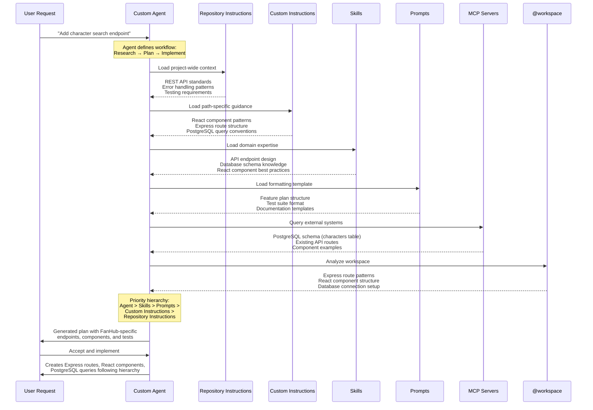

# Module 1: Instructions

## ⏰ — Establishing Foundations

> *"We've all felt it—Copilot giving wildly different suggestions to each of us. Let's fix that."*
> — Sarah, looking at the team's chaotic FanHub codebase

---

## 📖 The Story

The TechCorp team has cloned the FanHub starter project and experienced **The Struggle**. Everyone got different suggestions from Copilot because there are no documented patterns—the AI is as confused as a new hire with no onboarding docs.

**David** (Staff Engineer) knows the problem: *"Before anyone writes another line of code, we need to document what we have. Otherwise Copilot is just guessing—and so are we."* Every prompt Copilot sees includes unnecessary context because there's no architecture guide. It's wasting tokens analyzing the entire codebase just to understand basic structure.

**Sarah** (Senior Developer) has seen this movie before: *"See how the backend routes use three different async patterns? That's because the contractor had no standards. Let's fix that—and teach Copilot at the same time."*

**Elena** (Quality Champion) quickly discovers a limitation: *"My Python code needs different guidance than my JavaScript. My test files need different standards than my production code. But a single file treats everything the same."* She needs context-specific instructions that change based on what she's editing.

**This module's mission**: Build a complete instruction system that transforms how Copilot understands your project:

### Part 0: Quick Start
0. **`/init` command** — Let AI analyze your codebase and generate initial instructions automatically

### Part 1: The "Magic File" Foundation
1. **ARCHITECTURE.md** — Project context that reduces token waste
2. **`.github/copilot-instructions.md`** — 🪄 The "magic file" that applies to ALL interactions

### Part 2: Path-Based Context
3. **`.instructions.md` files** — Context-specific rules that only apply to matching files

### Enterprise: Organization-Wide Instructions
4. **Organization instructions** — Standards that apply to ALL repositories in your GitHub organization

> 🪄 **The Magic File**: `.github/copilot-instructions.md` is special—VS Code automatically loads it into **every** Copilot interaction. No manual invocation, no applyTo patterns. It just works, always. This is your repository-wide baseline.

---

⚠️ **Prerequisites**:
- Complete [Module 00: Orientation](../00-orientation/README.md)

---

## 🧠 Mindful Moment: Three Complementary Layers

**Traditional thinking:** *"I'll keep all instructions in one file and hope Copilot figures out the context."*

**AI-native thinking:** *"Different guidance belongs in different places. I'll use the magic file for repo-wide GitHub rules, path-based instructions for file-specific rules, and `AGENTS.md` when I want an agent playbook that travels across tools or subprojects."*

### The Three Core Surfaces

| Type | File | When Applied | Purpose |
|------|------|--------------|---------|
| 🪄 **Magic File** | `.github/copilot-instructions.md` | **Always** — every GitHub Copilot interaction in the repo | Repository-wide baseline standards for GitHub-native tooling |
| 📂 **Path-Based** | `.github/instructions/*.instructions.md` | **Conditionally** — only when matching `applyTo` patterns | Context-specific rules (frontend, backend, tests, Python, etc.) |
| 🤖 **Agent Playbook** | `AGENTS.md` | **By agent support and nearest location** | Portable agent guidance, local commands, subproject-specific workflows |

> 🪄 **Key Distinction**: `copilot-instructions.md` is your GitHub-wide baseline. `.instructions.md` files add precision with `applyTo`. `AGENTS.md` gives coding agents a predictable, tool-agnostic playbook and is especially useful in monorepos where the nearest file can describe a specific package.

---

💡 **Understanding `@workspace`**

Throughout this module, you'll use `@workspace` in your Copilot prompts. This powerful context operator:
- Gives Copilot access to your entire project structure
- Enables analysis across multiple files simultaneously
- Allows AI to understand relationships between components
- Makes documentation generation accurate and project-specific

Think of `@workspace` as giving Copilot the same bird's-eye view you have as a developer. Instead of seeing one file, it sees the whole system.

---

## 📚 Key Concepts

### Part 1: The Magic File Foundation

#### The Four-File Foundation

These files form the foundation of practical Copilot and agent customization:

**1. ARCHITECTURE.md (docs/ or repo root)**
- **Purpose**: Structural understanding + context efficiency
- **Value**: Copilot can reference architecture instead of analyzing entire codebase every time
- **Result**: Less tokens wasted, faster responses, more accurate suggestions
- **What to include**: Tech stack, folder structure, data flow, key patterns
- **What NOT to include**: Implementation details, code examples, exhaustive file lists

**2. .github/copilot-instructions.md** 🪄 **THE MAGIC FILE**
- **Purpose**: Automatic pattern standardization for ALL interactions
- **Value**: Every Copilot interaction follows your team's conventions, automatically
- **Result**: Consistent code style, reduced review cycles, fewer violations
- **What to include**: Coding conventions, library preferences, error patterns, testing requirements
- **What NOT to include**: Project structure, architecture decisions, context-specific rules
- **🪄 Magic**: This file is automatically included in every Copilot prompt—no manual invocation needed

**3. .instructions.md Files** 📂 **PATH-BASED**
- **Purpose**: Context-specific guidance that changes based on what you're editing
- **Value**: Frontend code gets frontend patterns, backend gets backend patterns, tests get test patterns
- **Result**: Zero context pollution—right guidance, right place, right time
- **What to include**: Layer-specific conventions, language-specific style, file-type-specific rules
- **Location**: `.github/instructions/` directory
- **📂 Conditional**: These files use `applyTo` glob patterns to match specific files

**4. AGENTS.md** 🤖 **AGENT PLAYBOOK**
- **Purpose**: Give coding agents a predictable place for setup commands, testing instructions, PR guidance, and local workflow rules
- **Value**: Works well as an open, portable convention across agent ecosystems, not just one GitHub surface
- **Result**: Agents can find the right commands and constraints faster, especially in nested subprojects
- **What to include**: Dev environment tips, test commands, repo navigation hints, PR instructions, subproject guardrails
- **Location**: Repo root or nested inside subdirectories such as `frontend/`, `backend/`, or `infra/`
- **🤖 Nearest wins**: In monorepos, the closest `AGENTS.md` is the most useful place for local package guidance

#### The /init Command: AI-Assisted Bootstrap

Before writing instructions manually, let the AI analyze your codebase first:

**`/init` slash command:**
- **Purpose**: Generate initial instructions by analyzing your codebase
- **How it works**: Scans project structure, package files, and code patterns
- **Output**: Creates `.github/copilot-instructions.md` or `AGENTS.md` with discovered conventions
- **Best for**: Starting a new project, onboarding existing codebases, updating after major changes

**The workflow:**
1. Run `/init` to get an AI-generated baseline
2. Review and refine the output
3. Add team-specific knowledge the AI couldn't discover
4. Decide whether the output belongs in `.github/copilot-instructions.md`, `AGENTS.md`, or both
5. Layer with path-based instructions for context specificity

**Which generated file should you keep?**

- Keep **`.github/copilot-instructions.md`** when the content is primarily GitHub Copilot baseline guidance for the whole repository
- Keep **`AGENTS.md`** when the content reads like agent operating instructions that should also make sense to other coding agents
- Keep **both** when you want GitHub-specific repo standards plus portable, nearest-directory agent playbooks

#### Organization-Wide Instructions (Enterprise)

For teams using GitHub Enterprise, organization-level instructions cascade to all repositories:

**`github.copilot.chat.organizationInstructions.enabled`:**
- **Purpose**: Apply consistent standards across ALL repositories in a GitHub organization
- **Value**: Security policies, compliance requirements, and company conventions enforced automatically
- **Result**: Every repository inherits baseline standards without per-repo configuration
- **Enabled by default**: Set to `false` to opt out

**Instruction hierarchy (all combined):**
1. 🏢 **Organization instructions** — Enterprise-wide baseline
2. 🪄 **Magic file** — Repository-specific standards
3. 📂 **Path-based** — Context-specific rules

> 💡 **Enterprise Tip:** Organization instructions are configured in GitHub Organization Settings → Copilot → Custom Instructions. Individual repositories can extend but not override organization rules.

#### How They Work Together

```
┌────────────────────────────────────────────────────────────────────┐
│ Every Copilot / Coding Agent Interaction                          │
├────────────────────────────────────────────────────────────────────┤
│ 0. Organization instructions → Enterprise baseline                │ 🏢 IF
│    (GitHub org settings)       Security, compliance               │ CONFIGURED
│                                                                    │
│ 1. ARCHITECTURE.md           → "What" and "Where"                 │
│    (project context)            Project structure & data flow      │
│                                                                    │
│ 2. copilot-instructions.md   → "How" (repo-wide, GitHub-native)   │ 🪄 ALWAYS
│    (magic file)                 Team standards for the whole repo  │ LOADED
│                                                                    │
│ 3. matching .instructions.md → "How" (path-specific)              │ 📂 LOADED
│    (applyTo rules)              Guidance for the current file type │ IF MATCHING
│                                                                    │
│ 4. nearest AGENTS.md         → "Operate here like this"           │ 🤖 WHEN
│    (agent playbook)             Commands, tests, local guardrails │ SUPPORTED
└────────────────────────────────────────────────────────────────────┘
```

#### How Copilot Orchestrate These Layers

When you invoke Copilot, it loads and combines context from all these sources in a specific priority order. Here's the complete sequence:



**Key insight:** Agents don't just follow one set of instructions—they orchestrate all of them. When conflicts arise, the priority hierarchy ensures consistent behavior: agent instructions override skills, skills override prompts, prompts override custom instructions, and custom instructions override repository instructions.

### Part 2: Path-Based Instructions

#### The applyTo Pattern System

Path-based `.instructions.md` files use glob patterns to specify when they activate:

```yaml
---
applyTo: "glob pattern here"
---
```

**Common patterns:**

| Pattern | Matches | Use Case |
|---------|---------|----------|
| `**/*.py` | All Python files | PEP 8 standards, type hints |
| `**/__tests__/**` | All test directories | Testing conventions, mocking |
| `frontend/src/**` | Frontend source files | React patterns, accessibility |
| `backend/src/routes/**` | API route files | REST conventions, auth patterns |
| `**/{Dockerfile,*.dockerfile}` | Docker files | Container best practices |
| `**/docs/**/*.md` | Documentation files | Stakeholder language, examples |

#### Layering Instructions

VS Code combines multiple instruction sources automatically:

**Order of application (all combined into context):**
1. 🪄 **Magic file:** `.github/copilot-instructions.md` (always, for all files)
2. 📂 **Path-specific:** Matching `.instructions.md` files (when patterns match)
3. 👤 **User profile:** Personal `.instructions.md` files (your preferences)

**Example scenario — editing `frontend/src/components/CharacterCard.tsx`:**
- ✅ `.github/copilot-instructions.md` — General standards (always)
- ✅ `.github/instructions/frontend.instructions.md` (applyTo: `frontend/**`) — UI patterns
- ✅ `.github/instructions/typescript.instructions.md` (applyTo: `**/*.{ts,tsx}`) — Type rules
- ❌ `.github/instructions/backend.instructions.md` (applyTo: `backend/**`) — Not applied

**Result:** Copilot gets comprehensive guidance layered from general to specific.

#### Recommended File Structure

```
repo/
├── .github/
│   ├── copilot-instructions.md       # 🪄 MAGIC FILE: Repository-wide baseline
│   ├── prompts/                      # Invokable functions (Module 3)
│   │   ├── test-suite.prompt.md
│   │   └── react-review.prompt.md
│   └── instructions/                 # 📂 PATH-BASED: Context-specific rules
│       ├── frontend.instructions.md  # UI layer guidance
│       ├── backend.instructions.md   # API layer guidance
│       ├── tests.instructions.md     # Testing conventions
│       ├── python.instructions.md    # Language-specific
│       └── docker.instructions.md    # Infrastructure patterns
├── AGENTS.md                         # 🤖 Root agent guardrails
├── frontend/
│   └── AGENTS.md                     # Frontend agent playbook
├── backend/
│   └── AGENTS.md                     # Backend agent playbook
└── infra/
    └── AGENTS.md                     # Infra agent playbook
```

> 📂 **Reference Pattern**: Use `.github/copilot-instructions.md` for repo-wide GitHub guidance, `.github/instructions/*.instructions.md` for additive file-pattern rules, and nested `AGENTS.md` files when subprojects need distinct agent workflows.

#### When to Use Which

| Need | Best File | Why |
|------|-----------|-----|
| Universal GitHub Copilot conventions for the whole repo | `.github/copilot-instructions.md` | Always-on repo constitution for GitHub-native flows |
| Different rules for tests, frontend, backend, or docs | `.github/instructions/*.instructions.md` | `applyTo` gives precise file-pattern targeting |
| Commands, tests, and guardrails an agent should follow in a specific directory | `AGENTS.md` | Nearest-file playbook works well for subprojects and cross-agent portability |
| Enterprise-wide baseline across many repositories | Organization instructions + repo files | Central standards with local extension |

---

## 🔨 Exercises

### Part 0: Quick Start

| # | Exercise | Lead | Support | Time | Topic |
|---|----------|------|---------|------|-------|
| [1.0](exercise-1.0.md) | Bootstrap with /init | David | Sarah, Elena | 8 min | 🚀 AI-Generated Baseline |

### Part 1: The Magic File Foundation

| # | Exercise | Lead | Support | Time | Topic |
|---|----------|------|---------|------|-------|
| [1.1](exercise-1.1.md) | Create ARCHITECTURE.md | David | All | 10 min | Documentation as Leverage |
| [1.2](exercise-1.2.md) | Create copilot-instructions.md | Sarah | All | 10 min | 🪄 The Magic File |

### Part 2: Path-Based Instructions and Agent Playbooks

| # | Exercise | Lead | Support | Time | Topic |
|---|----------|------|---------|------|-------|
| [1.3](exercise-1.3.md) | Path-Specific Instructions | Sarah | David | 10 min | Frontend vs Backend patterns |
| [1.4](exercise-1.4.md) | Language-Specific Standards | Elena | Marcus | 8 min | PEP 8, Airbnb, TypeScript |
| [1.5](exercise-1.5.md) | File-Type Specialized Guidance | Marcus | Elena, David | 12 min | Tests, Docker, Docs |
| [1.6](exercise-1.6.md) | Define Your Universe | Sarah | David | 15 min | Show-specific domain context + pointer pattern |

**Total Time**: ~73 minutes

---

## 📚 Official Documentation

### Quick Start (/init Command)
- **[VS Code: Set up workspace with /init](https://code.visualstudio.com/docs/copilot/customization/custom-instructions#_set-up-your-workspace-for-ai-with-init)** — Generate instructions from codebase analysis

### Magic File (copilot-instructions.md)
- **[VS Code: Custom Instructions](https://code.visualstudio.com/docs/copilot/customization/custom-instructions)** — Complete guide to `.github/copilot-instructions.md`
- **[GitHub Docs: Repository Instructions](https://docs.github.com/en/copilot/how-tos/configure-custom-instructions/add-repository-instructions)** — Official repository custom instructions documentation

### Path-Based Instructions (.instructions.md)
- **[VS Code: Instruction Files](https://code.visualstudio.com/docs/copilot/customization/custom-instructions#_instruction-files)** — Path-based instructions with `applyTo` patterns
- **[VS Code: Glob Patterns](https://code.visualstudio.com/docs/editor/glob-patterns)** — Understanding glob patterns for targeting files
- **[GitHub Tutorial: Your First Custom Instructions](https://docs.github.com/en/copilot/tutorials/customization-library/custom-instructions/your-first-custom-instructions)** — Step-by-step guide

### Organization-Wide Instructions (Enterprise)
- **[GitHub Docs: Organization Instructions](https://docs.github.com/en/copilot/how-tos/configure-custom-instructions/organization-instructions)** — Apply standards across all repositories

### Related Resources
- [VS Code: Copilot Chat Context](https://code.visualstudio.com/docs/copilot/copilot-chat#_chat-context) — Understanding `@workspace` and context operators
- [GitHub Docs: Prompt Engineering](https://docs.github.com/en/copilot/using-github-copilot/best-practices-for-using-github-copilot) — Best practices for working with Copilot

---

## ➡️ Next Up

**[Module 2: Agent Plan Mode](../02-agent-plan-mode/README.md)** — Monday 11:30 AM

Now that Copilot knows our structure (ARCHITECTURE.md), our repo-wide patterns (🪄 magic file), our context-specific rules (📂 path-based instructions), and where agent playbooks belong (`AGENTS.md`), let's teach it to think through problems before coding. David will discover AI planning for architectural decisions, Marcus will debug complex deployment issues, and the whole team will see how "plan first, code second" transforms their workflow.

> *"Copilot knows our patterns now—both universal and context-specific. But can it think through complex problems like we do?"*
> — David, ready to test Copilot's reasoning capabilities

---

## ✅ Module Checklist

Before moving to Module 2, verify:

### Part 0: Quick Start
- [ ] Ran `/init` command to generate baseline instructions
- [ ] Reviewed AI-generated output for accuracy
- [ ] Identified items needing refinement

### Part 1: Magic File Foundation
- [ ] `fanhub/docs/ARCHITECTURE.md` exists and includes: tech stack, folder structure, data flow
- [ ] `.github/copilot-instructions.md` exists with: coding conventions, library preferences, error patterns
- [ ] Copilot suggestions follow your documented patterns (test with a simple prompt)
- [ ] Team agrees on both documents (no "but I prefer..." objections)

### Part 2: Path-Based Instructions
- [ ] `.github/instructions/` directory created
- [ ] At least 2 layer-specific instructions (frontend, backend)
- [ ] At least 2 language-specific instructions (Python, JavaScript/TypeScript)
- [ ] At least 1 file-type instruction (tests, docker, or docs)
- [ ] Verified instructions apply correctly (edit a matching file, check Copilot's context)

---

#### 📌 Practices Used

| Practice | How It Applied |
|----------|----------------|
| 📚 **Documentation as Leverage** | Your ARCHITECTURE.md now benefits humans AND AI |
| 🪄 **Magic File for Universal Rules** | `copilot-instructions.md` applies to every interaction automatically |
| 📂 **Path-Based for Context-Specific** | `.instructions.md` files activate only when editing matching files |
| 🤖 **Agent Playbooks for Local Workflows** | `AGENTS.md` captures commands, tests, and guardrails where agents need them most |
| 🎯 **Right Guidance, Right Context** | Layer, language, and file-type instructions eliminate cross-context pollution |
| 🔄 **Iterate and Refine** | You reviewed and improved AI output before accepting |
| 🚀 **AI-First Bootstrap** | `/init` analyzed codebase before manual refinement |

#### 💭 Elena's Realization

*"I kept trying to put everything in one file. Now I understand—repo-wide GitHub rules go in the magic file, specific rules go in path-based instructions, and local agent workflows belong in `AGENTS.md`. My Python files get PEP 8, my tests get testing conventions, and my infrastructure agents get their own playbook."*

#### 💭 David's Insight

*"Running `/init` first was a game-changer. It found patterns in the codebase I'd forgotten existed. Then we just refined what it discovered instead of starting from scratch."*

---

## 🔗 Compounding Value

**What we created in this module:**
- AI-generated baseline via `/init` — Starting point from codebase analysis
- `docs/ARCHITECTURE.md` — Project context
- `.github/copilot-instructions.md` — 🪄 Universal team patterns
- `.github/instructions/*.instructions.md` — 📂 Context-specific rules
- `AGENTS.md` — 🤖 Portable agent playbook when repo or subproject workflows need it

**How this helps in future modules:**

| Module | How Today's Work Helps |
|--------|----------------------|
| Module 2 | Agent plan mode uses your architecture context |
| Module 3 | Custom prompts can reference documented patterns |
| Module 4 | Agent skills build on your established conventions |
| Module 5 | MCP servers extend your infrastructure patterns |
| Module 6 | Custom agents leverage all your instruction layers |

Every minute invested here saves hours later.

---

## 🧠 Mindful Moment: The Layered Transformation

**Before this module:**
- Copilot gave everyone different suggestions
- Frontend code got backend patterns (context pollution)
- Python files got JavaScript conventions (language confusion)
- Code reviews caught inconsistencies at every level
- The codebase was heading toward entropy

**After this module:**
- 🪄 The magic file ensures UNIVERSAL consistency
- 📂 Path-based instructions ensure CONTEXTUAL accuracy
- 🤖 `AGENTS.md` gives agents a portable operating playbook where local commands matter
- Frontend code gets frontend patterns, Python gets PEP 8
- Code reviews focus on logic, not style or context mismatches
- The codebase has gravity—it pulls code toward the right patterns

**The shift**: Instructions are not one file. They're a layered system—repo baseline, contextual precision, and optional agent playbooks.

---

## 🎭 Behind the Scenes: What Just Happened

For those who want to understand the deeper mechanics:

### Why `.github/copilot-instructions.md` is "Magic" 🪄

1. **Automatic inclusion**: VS Code automatically loads this file into every Copilot prompt
2. **No configuration needed**: Unlike `.instructions.md` files, no `applyTo` pattern required
3. **Universal application**: Applies whether you're editing Python, JavaScript, tests, or docs
4. **Team consistency**: Every team member gets the same baseline context automatically

### How Path-Based Instructions Layer 📂

When you edit a file, VS Code:
1. **Always loads**: `.github/copilot-instructions.md` (the magic file)
2. **Scans**: `.github/instructions/` directory for `*.instructions.md` files
3. **Evaluates**: Each file's `applyTo` pattern against the current file path
4. **Combines**: All matching instructions into Copilot's context
5. **Sends**: The layered context with every chat request

### Where `AGENTS.md` Fits 🤖

`AGENTS.md` is different from GitHub's `.instructions.md` system. It is an open Markdown convention for coding agents that usually contains setup commands, testing instructions, PR rules, and directory-local guidance. In a polyrepo, a single root `AGENTS.md` may be enough. In a monorepo, nested `AGENTS.md` files are often better because a frontend package and an infrastructure package may need different commands and guardrails.

**Rule of thumb:**
1. Put universal GitHub rules in `.github/copilot-instructions.md`
2. Put file-pattern rules in `.github/instructions/*.instructions.md`
3. Put local agent workflows and commands in the nearest `AGENTS.md`

### Why Architecture Documentation Matters to AI

Large Language Models like Copilot:
- Excel at pattern matching
- Struggle with implicit context
- Perform better with explicit relationships

Your `ARCHITECTURE.md` turns implicit knowledge ("everyone knows the frontend calls the backend") into explicit context that AI can use.

### The Virtuous Cycle

```
Documentation → Better AI suggestions →
Consistent code → Easier documentation →
Better AI suggestions → ...
```

This is the flywheel that separates teams who struggle with AI tools from teams who thrive.
