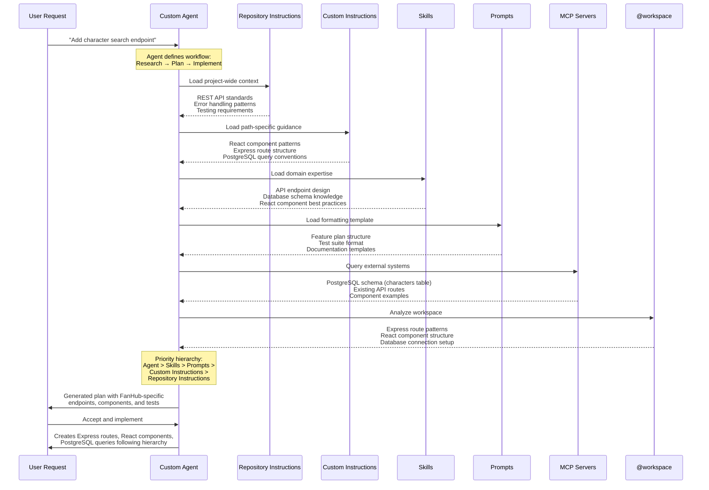

# Module 6: Custom Agents

## ⏰ — The Context-Switching Problem

> *"I have all these great tools—instructions, prompts, skills, MCP servers—but I'm constantly switching contexts. One minute I'm implementing, next I'm reviewing, then I'm trying to remember when live data matters. Each time I have to reset Copilot's behavior. I need workflow presets that bundle the right capabilities for each task."*
> — Sarah, switching between implementation and character review for the fifth time today

---

## 📖 Story So Far

In **Module 1**, the team created **repository instructions** (`.github/copilot-instructions.md`)—baseline coding standards that apply to all interactions.

In **Module 2**, they used **plan mode** with `@workspace` to research and analyze before implementing.

In **Module 3**, they built **prompt files** (`.prompt.md`)—invokable functions like `/test-suite` for specific tasks.

In **Module 1**, they added **custom instructions** (`.instructions.md`)—path-based guidance that auto-applies based on file context.

In **Module 4**, they created **Agent Skills** (`.github/skills/`)—specialized capabilities teaching Copilot domain-specific workflows.

In **Module 5**, they connected **MCP servers**—direct access to databases, APIs, and external systems.

**Now they're ready to automate and simplify.** Sarah switches between implementation mode and character-review mode multiple times per day. Elena wants the character-review workflow from Modules 3.2, 4.2, and 5.2 bundled into one preset instead of rebuilt from memory. Marcus sees an opportunity to keep review grounded in live FanHub data when duplicate records matter. David wants the workflow transitions themselves to be explicit, repeatable, and easy to hand off.

**The pattern:** Each workflow uses different tools, instructions, and behaviors—but manually configuring these for every context switch wastes time and mental energy.

**The automation:** Custom agents bundle instructions, tools, skills, and MCP servers into workflow presets you can instantly switch between, eliminating repetitive setup.

💡 **Integration Note:** This module orchestrates everything from Modules 1-6 by creating **custom agents** (`.agent.md`)—workflow configurations that bundle repository instructions, skills, MCP servers, and tool selections into switchable presets. **Think of agents as workflows** that define complete working modes with specific tool access and behavioral constraints. Unlike skills (which teach capabilities) or instructions (which define behavior), agents orchestrate multi-step processes.

---

⚠️ **Prerequisites**:
- Complete [Module 00: Orientation](../00-orientation/README.md)
- Complete [Module 04: Agent Skills](../04-agent-skills/README.md) — Understanding skills helps you decide which to include in agents
- Complete [Module 05: MCP Servers](../05-mcp-servers/README.md) — Agents can bundle MCP server access
- VS Code 1.109+ (for invocation controls, model fallback, and agent orchestration controls)

---

> 💡 **Experimental Feature: Custom Agents in Subagents**
>
> If you want to use custom agents with subagents (for example, using a specialized research agent within a development task), you'll need to enable this experimental feature:
>
> 1. Open Settings (Ctrl+,)
> 2. Search for `chat.customAgentInSubagent.enabled`
> 3. Enable the setting
> 4. Ensure your custom agent doesn't have `infer: false` in its frontmatter (which prevents subagent use)
>
> Once enabled, you can prompt Copilot to use specific custom or built-in agents as subagents. For example:
> - "Run the research agent as a subagent to research the best auth methods for this project."
> - "Use the plan agent in a subagent to create an implementation plan for myfeature. Then save the plan in plans/myfeature.plan.md"
>
> **Learn more:** [Using custom agents with subagents](https://code.visualstudio.com/docs/copilot/chat/chat-sessions#_use-a-custom-agent-with-subagents-experimental)

---

## 🧠 Mindful Moment: From Tool Collections to Role Presets

**Traditional thinking:** *"I'll memorize which tools to use for each task and manually configure Copilot each time."*

**AI-native thinking:** *"I'll create workflow-based agents that automatically configure tools, instructions, and capabilities for specific tasks—switching contexts becomes instant."*

This isn't just about convenience. Custom agents transform Copilot from a general-purpose assistant into a specialized teammate for each role. A "Character Review" agent can stay read-only while bundling the team's prompt, skill, and MCP workflow. An "Implement" agent can focus on systematic Feature Spec execution and then hand off cleanly into review. A "DevOps" agent can still bundle infrastructure skills and deployment MCP servers. The result: context-appropriate AI assistance with zero configuration overhead.

---

## 💡 Understanding Custom Agents

**Custom agents** are workflow-based Copilot configurations that bundle instructions, available tools, skills, MCP servers, and behavioral constraints into switchable presets. Each agent defines a complete working mode for specific tasks.

**How they work:**
- **YAML frontmatter** — Defines agent name, description, tools list, model, handoffs, and optional MCP servers
- **Markdown body** — Contains agent-specific instructions and guidelines
- **Progressive loading** — Agent appears in dropdown, instructions load when selected
- **Handoffs** — Define workflow transitions between agents with pre-filled prompts

**Why this matters for FanHub:**
- **@character-review** agent — Read-only character-detail review using the prompt, skill, and MCP-backed duplicate investigation workflow
- **@implement** agent — Full editing capabilities with implementation-focused instructions
- **@character-review** agent — Character-detail review with prompt, skill, and MCP-aware escalation
- **@test** agent — Test generation with comprehensive template and edge case focus

**Key capabilities:**

**Tool Selection:**
- Specify exactly which tools are available: `['search', 'fetch', 'usages']` for character review
- Prevent unwanted actions: No edit tools during review, no MCP servers during testing
- Include skill-specific tools: `'api-endpoint-design/*'` loads all tools from that skill

**Handoffs:**
- Create guided workflows: Plan → Implement → Review → Test
- Pre-fill next prompt: "Now implement the plan outlined above"
- Optional auto-send: `send: true` to immediately transition
- Button appears after agent completes response

**Scopes:**
- **Workspace agents:** `.github/agents/*.agent.md` — team-shared, version-controlled
- **User profile agents:** `~/.copilot/agents/*.agent.md` — personal preferences
- **Organization agents:** Shared across multiple repos (experimental)

**Targets:**
- `target: vscode` — Local VS Code only
- `target: github-copilot` — Usable on github.copilot.com (requires `mcp-servers` config in frontmatter)

---

## What You'll Learn

**Custom agents** bundle instructions, tools, skills, and MCP servers into workflow configurations you can instantly switch between. You'll create specialized agents for implementation and character review, then end with an "art of the possible" example showing how agent teams can extend those ideas further.

**Time:** ~75 minutes | **Exercises:** 5

---

## 📋 Exercise Planning

The exercises below create custom agents that orchestrate capabilities from Modules 1-6 into workflow presets. Each exercise solves context-switching problems and demonstrates different agent patterns.

| # | Exercise | Lead | Support | Problem | Solution | Key Metrics | Artifacts |
|---|----------|------|---------|---------|----------|-------------|-----------|
| [6.1](exercise-6.1.md) | Understand the Default Plan Agent | All | All | Need to understand agent structure before building custom ones: frontmatter, tools, handoffs, stopping rules, workflows | Reverse-engineer Microsoft's `@plan` agent to learn production-quality patterns for role enforcement, tool selection, and workflow design | 100% questions answered, understand all agent components, ready to build own agents | Knowledge of agent architecture and best practices |
| [6.2](exercise-6.2.md) | Create Character Review Agent | Elena | Sarah | Manual review setup: 5 min rebuilding prompt, skill, and MCP context before each character-detail review | `@character-review` agent with read-only tools that bundles the Module 3.2 prompt, Module 4.2 skill, and Module 5.2 MCP workflow into one role | 5→0 min setup, repeatable review behavior, live-data checks easier to trigger | `.github/agents/character-review.agent.md` |
| [6.3](exercise-6.3.md) | Create Implementation Agent for Feature Spec Execution | Sarah | Marcus, David | Manual Feature Spec implementation: 8 min reading/searching, 60% first-time completeness (missing components), ad-hoc order causing rework | `@implement` agent with full editing tools, Feature Spec-reading workflow, handoff to @character-review | 8→0 min setup, 60%→100% completeness, systematic execution order, integrated review workflow | `.github/agents/implement.agent.md` |
| [6.4](exercise-6.4.md) | Sharpen the Feature Spec | David | Sarah, Marcus | Implementation agent produces incomplete or misaligned output when the spec leaves gaps | Use `@plan` to audit and improve the Feature Spec before passing it to `@implement` — resolve API shapes, migrations, and test expectations from real codebase evidence | Spec grows from design doc to implementation contract; `/implement` output is more complete and reliable | Improved `fanhub/docs/FEATURE-CHARACTER-DETAIL.md` |
| [6.5](exercise-6.5.md) | Explore Agent Teams with Squad | Marcus | Sarah, Rafael | Custom agents solve focused workflow problems, but it is still hard to picture what a persistent multi-agent development team could look like in practice | Install Squad, initialize a team in the repo, and use it for a simple FanHub-style agent-team interaction | working Squad install, `.squad/` created, clear understanding of custom agents vs. agent teams | `.squad/`, initial Squad team setup |

---

## 📚 What This Feature Does

**Custom Agents:** Workflow-based Copilot configurations stored in `.agent.md` files that define available tools, loaded skills, MCP servers, behavioral instructions, and workflow handoffs for specific tasks.

**When to use it:** When different tasks require different capabilities—review needs read-only analysis tools, implementation needs full editing, and handoffs should make the workflow between them explicit. Use custom agents when you want to eliminate context-switching overhead and enforce role-appropriate tool usage.

**What you'll build:**
- **Character review agent** — Read-only tools, character-review workflow, duplicate-data escalation through MCP when relevant
- **Implementation agent** — Full editing capabilities, systematic Feature Spec execution workflow
- **Connected workflow** — Handoff from implementation into prompt + skill + MCP-backed character review
- **Sharpened Feature Spec** — Plan mode audits and improves the spec before implementation runs
- **Agent-team capstone** — An example of persistent multi-agent collaboration using Squad

**Official Documentation:**
- 📖 [Custom agents in VS Code](https://code.visualstudio.com/docs/copilot/customization/custom-agents) — Complete guide to agent structure, handoffs, and tool configuration
- 📖 [Custom agents tutorials](https://docs.github.com/en/copilot/tutorials/customization-library/custom-agents) — Example agents including implementation planner, bug fix specialist, cleanup agent

> 💡 **Important for this module:** The key payoff is not just creating agents—it is creating the right boundaries between them. Review agents should stay read-only. Implementation agents should be able to edit. Handoffs make that workflow feel natural instead of manual.

---

## 📚 Key Concepts

### How Custom Agents Orchestrate All Customization Layers

Custom agents sit at the top of the hierarchy, orchestrating all the customization capabilities you've built in Modules 1-6. When you invoke an agent, it loads and combines context from multiple sources following a priority hierarchy.



**Key takeaways from this flow:**

1. **Agents orchestrate everything** — They're not just another customization layer; they define which tools, skills, and instructions are available for specific tasks
2. **Context loads in priority order** — Agent instructions override skills, skills override prompts, prompts override custom instructions, custom instructions override repository instructions
3. **@workspace provides dynamic context** — While other layers provide static guidance, workspace analysis adapts to your actual codebase
4. **MCP servers extend capabilities** — Agents can access external systems (databases, APIs, web) that static instructions can't reach

This diagram shows why Module 6 is the culmination of everything you've learned—custom agents bring all customization capabilities together into coherent, executable workflows.

---

### Agent File Structure

Custom agents are Markdown files with `.agent.md` extension stored in `.github/agents/` (workspace) or `~/.copilot/agents/` (user profile).

**Anatomy of an agent file:**

```markdown
---
description: Generate an implementation plan for new features
name: Planner
tools: ['search', 'fetch', 'githubRepo', 'usages']
model: Claude Sonnet 4
handoffs:
  - label: Start Implementation
    agent: implement
    prompt: Now implement the plan outlined above.
    send: false
---
# Planning Instructions

You are in planning mode. Your task is to generate implementation plans.
Don't make any code edits—research and analysis only.

When generating plans, include:
- Overview of the feature
- Requirements and constraints
- Implementation steps with file paths
- Testing strategy
```

**Frontmatter fields:**

| Field | Purpose | Example |
|-------|---------|---------|
| `description` | Brief agent description shown as placeholder text | `"Security-focused code review"` |
| `name` | Agent display name (defaults to filename) | `"Security Reviewer"` |
| `tools` | List of available tools | `['search', 'analysis']` |
| `model` | Preferred AI model (with optional fallback) | `"Claude Sonnet 4"` or `["Claude Opus 4.5", "Claude Sonnet 4"]` |
| `handoffs` | Workflow transitions to other agents | See handoff structure below |
| `target` | Where agent runs | `"vscode"` or `"github-copilot"` |
| `mcp-servers` | MCP config for web agents | See web agent structure below |
| `infer` | Enable as subagent (default true) | `false` to disable |
| `argument-hint` | Input guidance text | `"Describe the security concern"` |
| `user-invokable` | Can users directly invoke this agent? (1.109) | `false` for subagent-only |
| `disable-model-invocation` | Prevent model from invoking this agent (1.109) | `true` for user-only agents |
| `agents` | Allow/deny specific agents as subagents (1.109) | `{allow: ['plan', 'search']}` |

### Handoff Structure

Handoffs create guided sequential workflows between agents:

```yaml
handoffs:
  - label: Review Character Change            # Button text
    agent: character-review                   # Target agent ID
    prompt: Review the character detail change # Pre-filled prompt
    send: false                  # Auto-submit (true/false)
```

**Common handoff patterns:**
- **Implement → Review** — Complete code, hand off to character review
- **Review → Implement** — Find issues, hand back to fix them
- **Review → Test** — Surface edge cases, then hand off to generate or update tests

### Invocation Controls (VS Code 1.109)

New frontmatter fields provide fine-grained control over how agents can be invoked:

**`user-invokable`** — Control direct user access:
```yaml
---
name: Implementation Helper
user-invokable: false  # Hidden from dropdown, only callable as subagent
---
```

**`disable-model-invocation`** — Prevent automatic model invocation:
```yaml
---
name: Dangerous Operations
disable-model-invocation: true  # Only users can invoke, never the model
---
```

**`agents`** — Restrict which agents can be used as subagents:
```yaml
---
name: Conductor
agents:
  allow: ['plan', 'search', 'research']  # Only these agents available
  # OR
  deny: ['dangerous-ops', 'deploy']       # These agents blocked
---
```

**Orchestration pattern example:**
```yaml
---
name: Conductor
description: Orchestrates development workflow
user-invokable: true
agents:
  allow: ['planner', 'implementer', 'reviewer']
model: Claude Opus 4.5
---

---
name: Planner
user-invokable: false  # Subagent only
tools: ['search', 'fetch', 'githubRepo']
model: GPT-5
---

---
name: Implementer
user-invokable: false  # Subagent only
tools: ['edit', 'create', 'search']
model: Claude Sonnet 4
---
```

**When to use each control:**
| Control | Use Case |
|---------|----------|
| `user-invokable: false` | Specialized subagents that shouldn't clutter dropdown |
| `disable-model-invocation: true` | Sensitive operations requiring explicit user approval |
| `agents.allow` | Limit orchestration scope to specific trusted agents |
| `agents.deny` | Block specific dangerous or incompatible agents |

### Model Configuration with Fallback

The `model` field now supports fallback chains (VS Code 1.109):

```yaml
---
name: Complex Analysis
model:
  - "Claude Opus 4.5"     # Try first (best for complex reasoning)
  - "Claude Sonnet 4"     # Fallback if Opus unavailable
  - "GPT-5"               # Final fallback
---
```

**Why fallback matters:**
- Handle model availability variations
- Balance cost vs. capability automatically
- Ensure agent works across different subscriptions

### Tool Selection

Specify exactly which tools are available to enforce role-appropriate behavior:

**Read-only research:**
```yaml
tools: ['search', 'fetch', 'githubRepo', 'usages']
```

**Full implementation:**
```yaml
tools: ['edit', 'create', 'delete', 'search', 'fetch']
```

**Analysis only:**
```yaml
tools: ['search', 'fetch', 'analysis', 'linter']
```

**Include skill tools:**
```yaml
tools: ['search', 'fetch', 'api-endpoint-design/*']
```

### Web-Accessible Agents

Agents with `target: github-copilot` work on github.copilot.com and require inline MCP configuration:

```yaml
---
name: Product Analyzer
target: github-copilot
mcp-servers:
  - name: github
    config:
      command: npx
      args: [-y, "@modelcontextprotocol/server-github"]
      env:
        GITHUB_PERSONAL_ACCESS_TOKEN: "{{secrets.GITHUB_PERSONAL_ACCESS_TOKEN}}"
tools: ['effort-estimator/*', 'github/*']
---
```

**Key differences:**
- Must include `mcp-servers` array with full server config
- No stdio-based MCP (web can't spawn local processes)
- Requires HTTP-based MCP servers or web-compatible tools
- Secrets referenced via `{{secrets.SECRET_NAME}}` syntax

### Agent Discovery and Activation

**VS Code detects agents:**
1. Any `.agent.md` in `.github/agents/` (workspace)
2. Any `.agent.md` in `~/.copilot/agents/` (user profile)
3. Organization agents (if `showOrganizationAndEnterpriseAgents` setting enabled)

**Switching agents:**
- Use agent dropdown in chat panel
- Type `@agent-name` in chat input
- Handoff buttons after agent responses

**Hiding agents:**
- Select "Configure Custom Agents" from dropdown
- Click eye icon to show/hide specific agents

---

## 📌 Practices Used

| Practice | How It Applied in This Module |
|----------|-------------------------------|
| 📚 **Separation of Concerns** | Planning agents have read-only tools; implementation agents have editing tools—enforced by agent configuration |
| 🎯 **Workflow Presets** | Each agent bundles tools, skills, and instructions for specific tasks, eliminating manual configuration |
| 🔄 **Guided Workflows** | Handoffs create sequential workflows (Plan → Implement → Review) with pre-filled prompts |
| 🔗 **Capability Orchestration** | Agents combine repository instructions, skills, MCP servers, and tool selections from Modules 1-6 |
| 🔒 **Invocation Controls** | `user-invokable`, `disable-model-invocation`, and `agents` restrict who/what can invoke each agent (1.109) |
| 🎚️ **Model Fallback** | Multi-model arrays ensure agents work across availability and subscription variations (1.109) |

---

## 🎭 Behind the Scenes

*For those who want to understand the deeper mechanics:*

### How Agent Loading Works

When you select an agent in VS Code:

1. **Dropdown population**: VS Code scans `.github/agents/` and `~/.copilot/agents/`, reads YAML frontmatter from all `.agent.md` files, displays `name` and `description`
2. **Agent selection**: You pick an agent from dropdown or type `@agent-name`
3. **Configuration loading**: Copilot loads agent's frontmatter configuration—tools list, model preference, handoff definitions
4. **Instruction prepending**: Agent's Markdown body is prepended to your chat prompt as system-level instructions
5. **Tool filtering**: Only tools specified in agent's `tools` array are available for this conversation
6. **Skill activation**: If agent instructions reference skills or if `tools` includes skill patterns like `'skill-name/*'`, those skills become available
7. **MCP connection**: If agent references MCP servers (either via workspace MCP config or inline `mcp-servers` field), those connections are established

**Progressive loading:**
- Agent **metadata** (name, description) is always loaded for discovery
- Agent **instructions** are loaded when agent is selected
- **Skills** are loaded if agent references them
- **MCP servers** connect when agent needs them

### Tool List Priority

The list of available tools follows this priority order:

1. **Prompt file tools** (if using a `.prompt.md` file)
2. **Agent tools** (from current agent's `tools` field)
3. **Default tools** (base Copilot capabilities)

This means:
- Agent tool restrictions can't be overridden by prompts
- Read-only agents stay read-only even if you ask for edits
- Custom agents enforce their tool boundaries

### Handoff Execution Flow

When a handoff button is clicked:

1. **Context preservation**: Current conversation context is maintained
2. **Agent switch**: VS Code changes to target agent (loads its tools and instructions)
3. **Prompt injection**: Handoff prompt is inserted into chat input (but not sent)
4. **Optional auto-send**: If `send: true`, prompt is automatically submitted
5. **New conversation**: Target agent processes prompt with its own tool set and instructions

**Why handoffs matter:**
- Eliminates manual copy-paste between agents
- Ensures smooth workflow transitions
- Maintains context across role switches
- Allows review before proceeding (if `send: false`)

### Web Agent Execution

Web-accessible agents (`target: github-copilot`) work differently:

**Local agents (target: vscode):**
- Run in VS Code process
- Can use stdio-based MCP (spawn local processes)
- Access local file system directly
- No inline MCP config needed (uses workspace `.vscode/mcp.json`)

**Web agents (target: github-copilot):**
- Run on GitHub's servers (github.copilot.com)
- Require inline `mcp-servers` config in frontmatter
- Can only use HTTP-based MCP servers (no local processes)
- Secrets managed via GitHub settings
- Workspace access requires repo authorization

**Key Takeaway:** Create local agents for development workflows requiring file system access. Create web agents for analysis, planning, or product workflows that need to work during meetings or from any browser.

---

## ➡️ Workshop Complete!

**Congratulations!** You've completed the FanHub transformation workshop. Over the past 8-9 hours, you've built a complete AI customization system:

**What you've mastered:**
- ✅ **Repository instructions** — Baseline standards that apply to every Copilot interaction
- ✅ **Plan mode** — Structured thinking and systematic AI collaboration
- ✅ **Custom prompts** — Reusable functions for common tasks
- ✅ **Custom instructions** — File-scoped context with automatic application
- ✅ **Agent skills** — Domain expertise Copilot loads automatically
- ✅ **MCP servers** — Direct integration with databases and external systems
- ✅ **Custom agents** — Workflow presets that orchestrate everything

**The transformation:**
- Generic Copilot → Architecture-aware AI teammate
- Reactive coding → Strategic planning and execution
- Manual workflows → Automated, repeatable processes
- Individual tools → Orchestrated agent workflows

**Beyond the workshop:**

Now that you've mastered these customization techniques in the workshop context, you can explore advanced topics as standalone tech talks:

- **GitHub Copilot on the Web** — Multi-interface AI across browser and mobile (see `tech-talks/copilot-web/`)
- **GitHub Copilot CLI** — Terminal-native automation with Plan Mode (see `tech-talks/copilot-cli/`)
- **Agentic Sessions** — Multi-environment agent orchestration (see `tech-talks/agentic-sessions/`)
- **Enterprise Patterns** — Organization-wide scaling and governance (see `tech-talks/enterprise-patterns/`)
- **Copilot Hooks** — Lifecycle validation and compliance automation (see `tech-talks/copilot-hooks/`)

**Share your success:**
- Share your FanHub repository with your team
- Document your ROI metrics (time saved, quality improvements)
- Present your customization approach to stakeholders
- Help others adopt AI-native development practices

---

**You've proven that AI-assisted development is the real deal. Well done!** 🎉
